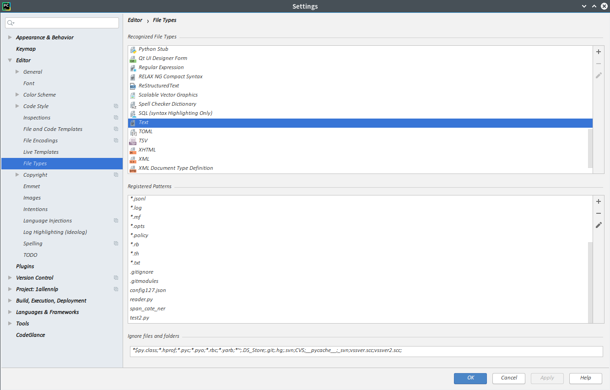
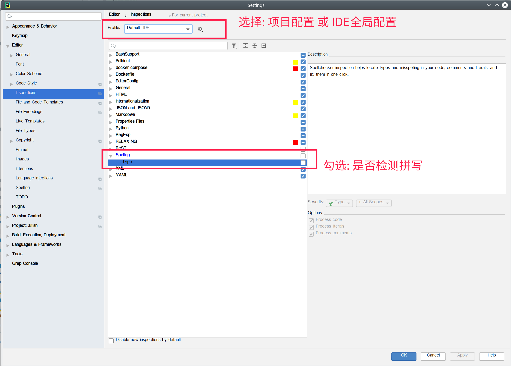
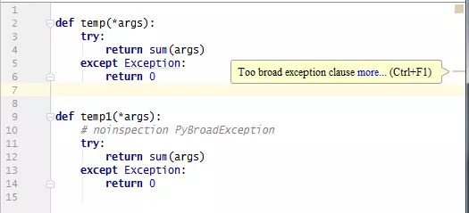

## 配置

### 常用代码片段配置

****

>  配置路径   Setting--->Editor--->Live Templates--->加号按钮

```python
~nos     
# noinspection PyMethodMayBeStatic

# ~err
error = '\n'.join(traceback.format_exception(*sys.exc_info()))

# ~path
path = os.path.join(os.path.dirname(__file__), '')

# ~root
def root(*f, relative_root='../../../'):
    # relative_root 当前代码目录相对root的相对路径
    for t in f:
        if t[:1] == '/':
            print('Warning: root()包含绝对路径 参数={}'.format(f))
            break
    code_dir = os.path.dirname(os.path.realpath(__file__))
    long_path = os.path.join(code_dir, relative_root, *f)
    return long_path
```

### 快捷键配置

Keymap---方案设置成NetBeans

| 名称               | 快捷键             | 说明               |
| ------------------ | ------------------ | ------------------ |
| Reformat           | Ctrl+Alt+L  需设置 | Code格式化代码     |
| Move Line Up       | Alt+Up  需设置     | 当前行往上挪一行   |
| Move Line Down     | Alt+Down  需设置   | 当前行往上挪一行   |
| Optimize Imports   | Ctrl+Shift+I       | 优化导入代码       |
|                    | Ctrl+F12           | 跳转到方法（列表） |
|                    | Ctrl + F11         | 设置书签           |
|                    |                    |                    |
|                    | SHIFT F11          | 显示所有书签       |
| Go to Bookmark 1   | Ctrl+Alt+1  需设置 | 跳转到 该书签      |
| Next Bookmark      | Ctrl+Shift+.       | 跳转到下个书签     |
| Previous Bookmark  | Ctrl+Shift+逗号    | 跳转到上个书签     |
| Decrease Font Size | Ctrl+Alt+减号      | 减小字体大小       |
| Increase Font Size | Ctrl+Alt+=         | 增加字体大小       |
|                    |                    |                    |
|                    |                    |                    |
|                    |                    |                    |
|                    |                    |                    |
|                    |                    |                    |
|                    |                    |                    |

**常用快捷键**

把展开代码块，设置成递归的：

设置》Keymap》Main menu 》Code》Folding 》Expand   删除快捷键

设置》Keymap》Main menu 》Code》Folding 》Expand Recursively   增加快捷键 Ctrl+=

| 快捷键               | 作用                                        |
| -------------------- | ------------------------------------------- |
| Ctrl+Q               | 查看当前函数有什么参数                      |
| Ctrl+Alt+L           | 格式化代码                                  |
| Ctrl+Shift+加号/减号 | 展开/折叠所有代码块                         |
| Ctrl + 加号/减号     | 展开/折叠代码块（当前位置的：函数，注释等） |
| Ctrl + Alt + E       | Show Useage                                 |
|                      |                                             |
|                      |                                             |
|                      |                                             |
|                      |                                             |
|                      |                                             |
|                      |                                             |
|                      |                                             |
|                      |                                             |
|                      |                                             |


### 跳转到上个光标所在位置

​	打开 View---toolbar   有左右箭头按钮。悬停可以查看快捷键


### 插件

File---Setting---Plugins

数据库插件：

​	搜索datebase

​		安装 Database Navigator

​		~~安装Mongo Plugin~~

​	Grep Console 控制台文本颜色

默认logger的stream是输出到sys.stderr, 这是pycharm会把文字设置成红色. 如果设置stream到sys.stdout, 字体颜色就正常了

​	

### 显示界面和字体配置

```bash
界面的字体大小：
Setting-->Appearance&Behavior-->Appearance-->Use custom font

代码的字体大小：
Setting-->Editor-->Font

控制台的字体大小:
Setting-->Editor-->Color Scheme-->Console Font
```

## 常见BUG

### pycharm中所有代码无法自动提示处理方法

**解决方案：** 
1）打开pycharm后必须等待indexing全部结束； 
2）检查file菜单里，确保节能模式“power save mode”不被勾选。

### 某个文件不能代码高亮

原因: 自动识别成了text文件(误操作添加了文件类型)

解决方案:

设置--->Editor--->File Types--->找到文件名删除(一般在Text里面)




### 关闭错误检测提醒

PEP的错误提示，鼠标到错误提示行开头位置，出现灯泡，选择ignore like this

**setting--->Editor--->inspections**


| 说明             | 英文                        |
| ---------------- | --------------------------- |
| 捕捉异常范围太广 | Too broad exception clauses |
| 方法可能是静态的 | Method may be static        |
| 拼写检测         | Typo                        |
|                  |                             |
|                  |                             |
|                  |                             |
|                  |                             |





### 关闭某些错误提醒

让PyCharm 在代码检查时人为跳过某些特定部分的代码检查，便于强迫症和优化代码提示

使用方法：在需要跳过代码校验的部分加上注释即可， 如图：



| 注释 | 对应检查说明 |
| ---- | ------------ |
| # noinspection PyMethodMayBeStatic  | This inspection detects any methods which may safely be made static. |
| # noinspection PyAbstractClass  | This inspection detects when not all abstract properties/methods are defined in a subclass |
| # noinspection PyArgumentList  | This inspection reports discrepancies between declared parameters and actual arguments, as well as incorrect arguments (e.g. duplicate named arguments) and incorrect argument order. Decorators are analyzed, too. |
| # noinspection PyArgumentEqualDefault  | This inspection highlights situations, where argument passed to function is equal to default parameter value |
| # noinspection PyAssignmentToLoopOrWithParameter  | Checks for cases when you rewrite loop variable with inner loop    for i in xrange(5):        for i in xrange(20, 25):            print("Inner", i)            print("Outer", i)It also warns you if variable declared in with statement is redeclared inside of statement body:    with open("file") as f:        f.read()        with open("file") as f: |
| # noinspection PyAsyncCall  | This inspection highlights coroutines which were called without await |
| # noinspection PyAugmentAssignment  | This inspection highlights assignment that can be replaced with augmented assignment. |
| # noinspection PyAttributeOutsideInit  | This inspection detects instance attribute definition outside __init__ method |
| # noinspection PyBroadException  | This inspection highlights too broad exception clauses such as no exception class specified, or specified as 'Exception'. |
| # noinspection PyByteLiteral  | This inspection detects characters > 255 in byte literals. |
| # noinspection PyCallByClass  | This inspection checks for calls of a method by class while passing an instance of a different class as self parameter:    foo = Foo()    Bar.baz(foo, *more)Sometimes this may be intentional and correct. But when unintentional, this leads to subtle bugs. |
| # noinspection PyCallingNonCallable  | This inspection highlights attempts to call objects which are not callable, like, for example, tuples. |
| # noinspection PyChainedComparisons  | This inspection highlights chained comparisons that can be simplified. |
| # noinspection PyClassHasNoInit  | This inspection used when a class has no __init__ method, neither its parent classes. |
| # noinspection PyClassicStyleClass  | This inspection detects classic style classes usage. |
| # noinspection PyComparisonWithNone  | This inspection highlights comparisons with None. That type of comparisons should always be done with 'is' or 'is not', never the equality operators. |
| # noinspection PyCompatibility  | Enable this inspection if you need your code to be compatible with a range of Python versions (for example, if you're building a library). The range of Python versions with which the code needs to be compatible can be specified in the inspection settings. |
| # noinspection PyDataclass  | This inspection detects invalid definitions and usages of classes created with dataclasses or attr modules. |
| # noinspection PyDecorator  | This inspection reports usages of @classmethod or @staticmethod decorators on functions outside of a class. |
| # noinspection PyDefaultArgument  | This inspection detects when a mutable value as list or dictionary is detected in a default value for an argument. Default argument values are evaluated only once at function definition time, which means that modifying the default value of the argument will affect all subsequent calls of the function. |
| # noinspection PyDeprecation  | This inspection highlights usages of Python functions, classes or methods which are marked as deprecated (which raise a DeprecationWarning or a PendingDeprecationWarning). |
| # noinspection PyDictCreation  | This inspection detects situations when dictionary creation could be rewritten with dictionary literal. |
| # noinspection PyDictDuplicateKeys  | This inspection highlights using the same value as dictionary key twice. |
| # noinspection PyDocstringTypes  | This inspection highlights types in docstring which don't match dynamically inferred types. |
| # noinspection PyDunderSlots  | This inspection detects invalid definition of __slots__ in a class. |
| # noinspection PyExceptClausesOrder  | This inspection highlights situations when except clauses are not in the correct order (from the more specific to the more generic) or one exception class is caught twice. If you don't fix the order, some exceptions may not be catched by the most specific handler. |
| # noinspection PyExceptionInherit  | This inspection detects when a custom exception class is raised but doesn't inherit from the builtin "Exception" class. |
| # noinspection PyFromFutureImport  | This inspection detects 'from __future__ import' statements which are used not in the beginning of a file. |
| # noinspection PyGlobalUndefined  | This inspection is used when a variable is defined through the "global" statement but the variable is not defined in the module scope. |
| # noinspection PyInconsistentIndentation  | This inspection reports inconsistent indentation in Python source files (for example, use of a mixture of tabs and spaces). |
| # noinspection PyIncorrectDocstring  | This inspection detects mismatched parameters in a docstring. Please note that it doesn't warn you of missing parameters, if none of them is mentioned in a docstring. |
| # noinspection PyInitNewSignature  | This inspection checks mutual compatibility of __new__ and __init__ signatures. |
| # noinspection PyInterpreter  | This inspection notifies you if the current project has no Python interpreter configured or an invalid Python interpreter. |
| # noinspection PyListCreation  | This inspection detects situations when list creation could be rewritten with list literal. |
| # noinspection PyMandatoryEncoding  | This inspection detects lack of encoding magic comment for file. |
| # noinspection PyMethodFirstArgAssignment  | This inspection detects cases when first parameter, such as 'self' or 'cls', is reassigned in a method. In most cases imaginable, there's no point in such reassignment, and it indicates an error. |
| # noinspection PyMethodOverriding  | This inspection detects inconsistencies in overriding method signatures. |
| # noinspection PyMethodParameters  | This inspection looks for methods that lack a first parameter (which is usually named self ). |
| # noinspection PyMissingConstructor  | This inspection warns if call to super constructor in class is missed |
| # noinspection PyMissingOrEmptyDocstring  | This inspection detects lack of docstring and an empty docstring. |
| # noinspection PyMissingTypeHints  | This inspection detects lack of type hints for function declaration in one of the two formats: parameter annotations or a type comment |
| # noinspection PyNamedTuple  | This inspection detects invalid definition of namedtuple. |
| # noinspection PyNestedDecorators  | This inspection looks for certain decorators that don't nest well. |
| # noinspection PyNonAsciiChar  | This inspection detects file contains non-ASCII characters and doesn't have an encoding declaration at the top. |
| # noinspection PyNoneFunctionAssignment  | This inspection is similar to pylint inspection E1111. It highlights situations when an assignment is done on a function call but the inferred function doesn't return anything. |
| # noinspection PyOldStyleClasses  | This inspection highlights occurrences of new-style class features in old-style classes. |
| # noinspection PyOverloads  | This inspection validates overloads in regular Python files. |
| # noinspection PyPackageRequirements  | This inspection warns about imported or required, but not installed packages. |
| # noinspection PyPep8  | This inspection runs the pep8.py tool to check for violations of the PEP 8 coding style guide. |
| # noinspection PyPep8Naming  | This inspection checks the PEP8 naming conventions. |
| # noinspection PyPropertyAccess  | This inspection checks that properties are accessed correctly: read-only not set, write-only not read, non-deletable not deleted. |
| # noinspection PyPropertyDefinition  | This inspection checks that arguments to property() and functions annotated with @property and friends look reasonably. |
| # noinspection PyProtectedMember  | This inspection warns if a protected member is accessed outside the class, a descendant of the class where it's defined or a module. |
| # noinspection PyProtocol  | This inspection detects invalid definitions and usages of protocols introduced in PEP-544. |
| # noinspection PyRedeclaration  | This inspection detects unconditional redeclarations of names without being used in between, like this: def x(): passx = 2It applies to function and class declarations, and top-level assignments. |
| # noinspection PyRedundantParentheses  | This inspection highlights redundant parentheses in statements. |
| # noinspection PyReturnFromInit  | This inspection reports occurrences of return statements with a return value inside __init__ methods of classes. A constructor should not return any value. |
| # noinspection PySetFunctionToLiteral  | This inspection detects call for function "set" which can be replaced with set literal. |
| # noinspection PyShadowingBuiltins  | This inspection detects shadowing built-in names, such as 'len' or 'list'. |
| # noinspection PyShadowingNames  | This inspection detects shadowing names defined in outer scopes |
| # noinspection PySimplifyBooleanCheck  | This inspection detects equality comparison with a boolean literal. |
| # noinspection PySingleQuotedDocstring  | This inspection highlights docstrings not using triple double-quoted string format. |
| # noinspection PyStatementEffect  | This inspection detects statements without any effect. |
| # noinspection PyStringException  | This inspection detects when a string exception is raised. |
| # noinspection PyStringFormat  | This inspection detects errors in string formatting operations. |
| # noinspection PySuperArguments  | This inspection check that in any call to super(A, B), B either is an instance of A or a subclass of A. |
| # noinspection PyTestParametrized  | Test function, decorated with @pytest.mark.parametrize, must have arguments to accept parameters from decorator |
| # noinspection PyTrailingSemicolon  | This inspection detects trailing semicolons in statements. |
| # noinspection PyTupleAssignmentBalance  | This inspection check that the number of expressions on right-hand side and targets on left-hand side are the same. |
| # noinspection PyTupleItemAssignment  | This inspection detects assignments to tuple item. |
| # noinspection PyTypeChecker  | This inspection detects type errors in function call expressions. Due to dynamic dispatch and duck typing, this is possible in a limited but useful number of cases. Types of function parameters can be specified in docstrings or in Python 3 function annotations. |
| # noinspection PyTypeHints  | This inspection detects invalid usages of type hints. |
| # noinspection PyUnboundLocalVariable  | This inspection warns about local variables referenced before assignment. |
| # noinspection PyUnnecessaryBackslash  | This inspection highlights backslashes in places where line continuation is implicit (inside (), [], {}). |
| # noinspection PyUnreachableCode  | This inspection detects code which can not be normally reached. |
| # noinspection PyUnresolvedReferences  | This inspection detects names that should resolve but don't. Due to dynamic dispatch and duck typing, this is possible in a limited but useful number of cases. Top-level and class-level items are supported better than instance items. |
| # noinspection PyUnusedLocal  | This inspection highlights local variables,parameters or local functions unused in scope. |


## 参考资料

> - []()
> - []()
