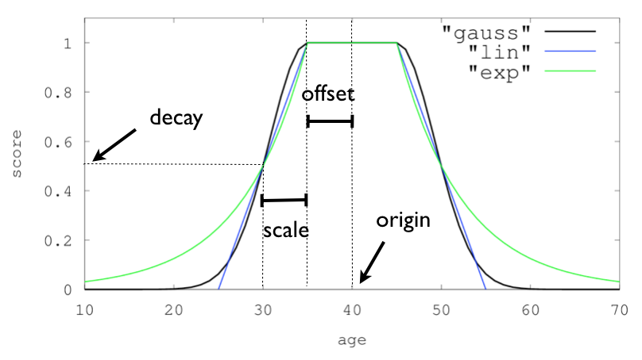

## Document元数据（MetaData）

元数据用于标注文档的相关信息：

_index：文档所在的索引名 
_type：文档所在的类型名 
_id：文档的唯一id 
_uid：组合uid，由_type和_id组成（6.x中_type不再起作用，同_id一样） 
_source：文档的原始json数据，可以从这里获取每个字段的内容 
_all：整合所有字段内容到该字段，默认禁用


## 搜索结果超出1万条的报错

如果数据量小于20万，那么简单方法是修改max_result_window

```bash
# PUT方法，$开头的是变量
PUT $ip:$port/$index/_settings
body = 
{ "index" : { "max_result_window" : 200000}}'
```

## Mappings

### 创建索引时，设定mappings

```bash
PUT $host:$port/$index
body = {
    "settings": {
        "number_of_shards": 1,    //分片节点数量
        "number_of_replicas": 0,  //复制节点数量
    },
    "mappings": {
        "_doc": {
            "properties": {
                "txt": {
                    "type": "text",
                    "analyzer": "ik_smart"  // ik-分词器
                }
            }
        }
    }
}

analyzer可选: "standard", "ik_smart", "english"
如果body={}  那么就使用ES的自动mappings
```

[字段的数据类型：](https://www.elastic.co/guide/en/elasticsearch/reference/7.0/mapping.html)

简单类型：[`text`](https://www.elastic.co/guide/en/elasticsearch/reference/7.0/text.html), [`keyword`](https://www.elastic.co/guide/en/elasticsearch/reference/7.0/keyword.html), [`date`](https://www.elastic.co/guide/en/elasticsearch/reference/7.0/date.html), [`long`](https://www.elastic.co/guide/en/elasticsearch/reference/7.0/number.html), [`double`](https://www.elastic.co/guide/en/elasticsearch/reference/7.0/number.html), [`boolean`](https://www.elastic.co/guide/en/elasticsearch/reference/7.0/boolean.html) or [`ip`](https://www.elastic.co/guide/en/elasticsearch/reference/7.0/ip.html).

json层级类型：[`object`](https://www.elastic.co/guide/en/elasticsearch/reference/7.0/object.html) or [`nested`](https://www.elastic.co/guide/en/elasticsearch/reference/7.0/nested.html).

专有类型：[`geo_point`](https://www.elastic.co/guide/en/elasticsearch/reference/7.0/geo-point.html), [`geo_shape`](https://www.elastic.co/guide/en/elasticsearch/reference/7.0/geo-shape.html), or [`completion`](https://www.elastic.co/guide/en/elasticsearch/reference/7.0/search-suggesters-completion.html).

## 

## 查看全局的信息

### 查看ES版本

```bash
GET $host:$port/
```

### 查看ES安装的插件列表

```bash
GET $host:$port/_cat/plugins   # 返回的文本（不是json）
```

## 搜索操作

### 搜索所有文档

```bash
# 某索引的某个类型的所有文档
GET $host:$port/$index/$type/_search

# 某索引的所有文档
GET $host:$port/$index/_search

# ES所有文档
GET $host:$port/_search
```

### 搜索符合条件的文档 (并排序)

```bash
# 某索引的某个类型的所有文档
POST $host:$port/$index/$type/_search
body = {
	"query": query
	"from": 0,    // 从0开始
    "size": 20,   // 取20个
    "sort": [     // 排序
    	{"age": {"order": "asc"}}  //asc升序  dsc降序
    ]
    "_source" : ["key1", "key2"]  // 返回信息包含的键
}

query = {"match_all": {}} // 搜索全部
```

#### 搜索参数

```bash
GET /_search
{
    "min_score": 0.5, // 分数最小值, 查询结果必须有 _score 字段
    "query" : query,
}
```


### 基础查询种类 

#### 数值符合范围

```json
query = {
    "range": {
        "字段名": {   # 符合则score=1 否则=0
            "gte": 20000,  //  gte是>=   gt是>
            "lte": 30000,   //  lte是<=   lt是<
            "boost": 1.5  // 分数权重
        }
    }  
}

query = {
    "range": {
        "字段名": {
            "from": 20000,  
            "to": 30000, 
            "boost": 1.5  // 分数权重
        }
    }
}
```

#### 词项匹配（不进行分词处理）

```json
query = {
	"term": {  
    	"_id": "ZUd6zmoBr51spxZUlcFQ",
    }
}

query = {
	"term": {  
    	"_id": {
            "value": "ZUd6zmoBr51spxZUlcFQ",
            "boost": 2
        }
    }
}

# terms是筛选，输出分数=1，不管匹配了多少个词项
# 如果希望有分数，则用 should 拼接 term
query = {  
    "terms": {  
        "featrue": ["盗窃", "自首"]  //或的关系
    }
}
```

#### 短语匹配（先分词，再查询分词结果和位置顺序都对的文档）

```json
query = {
    "match": {  
    	"txt": "关键词"
	}
}

query = {
    "match": {
        "txt": {
            "query":"我是中国人", 
            "boost": 2.0
        }
    }
}
```

#### 前缀匹配

```json
query = {
    "match_phase_prefix": {
        "name": {
            "query": "赵"
        }
    }
}
```

## 复合查询

### nested查询（数组元素是对象，查询符合条件的对象）

```json
query = {
    "nested":{
        "path": "字段1",
        "query": {  // 可以是任意query
            "match": {
                "字段1.字段2": "关键词"  //注意key需要有前置路径
            }
        }
    }
}

# 文档结构是：
{"字段1": // nested对象
    [  
    	{"字段2"： "文本内容"}
    ] 
}
```

### bool查询 

```json
query = {
    "bool" : {
        "must" : [     # 与  各个查询的分数相加
            {"term": {"price": 25} }  // query   
        ],
        "should" : [   # 或  各个查询的分数相加
            {"term": {"price": 25} }  // query   
        ],
        "must_not" : [  # 非
            {"term": {"price": 25} }  // query   
        ],
        "filter" : filter,
		"minimum_should_match" : 1,
		"boost" : 1.0,
    }
}
```

### filter

```json
filter = {
    "exists": {   # 存在字段
        "filed": "price"
    }
}
```

### boosting 查询（soft not)

```json
# 不复合negative查询的文档的得分不变
# 复合negative查询的文档的得分会乘以negative_boost
{
        "boosting":{
        "positive": p_query,
        "negative": n_query,
        "negative_boost": 0.2
    }
}
```


[排序功能说明](<https://www.elastic.co/guide/en/elasticsearch/reference/7.2/search-request-sort.html>)

```bash
# score_mode 对数组的数值进行融合后排序: 
# min最小值, max最大值, sum求和, avg平均值, median中位数
# multiply相乘, first
POST /_search
{
    "query": {
        "function_score": {
          "query": { "match_all": {} },
          "boost": "5", 
          "functions": [
              {
                  "filter": { "match": { "test": "bar" } },
                  "random_score": {}, 
                  "weight": 23
              },
              {
                  "filter": { "match": { "test": "cat" } },
                  "weight": 42
              }
          ],
          "max_boost": 42,   //计算出分数的上限
          "score_mode": "max",
          "boost_mode": "multiply",
          "min_score" : 42   //最小分数, 用于排除得分过低的文档
        }
    }
}
```

## function_score

衰减函数     [越近越好](<https://www.elastic.co/guide/cn/elasticsearch/guide/current/decay-functions.html>)

 `linear`线性 、 `exp`指数 和 `gauss`高斯函数 

它们可以操作数值、时间以及经纬度地理坐标点这样的字段。

```
origin
原点* 或字段可能的最佳值，落在原点 `origin` 上的文档评分 `_score` 为满分 `1.0` 

scale
衰减率，从原点origin下落时，评分 _score 改变的速度。（例如，每 £10 欧元或每 100 米）

decay
从原点 origin 衰减到 scale 所得的评分 _score ，默认值为 0.5 。
offset
以原点 origin 为中心点，为其设置一个非零的偏移量 offset 覆盖一个范围，而不只是单个原点。在范围 -offset <= origin <= +offset 内的所有评分 _score 都是 1.0 。

```



```bash
{
    "query": {
        "function_score": {
            "gauss": {
                "date": {
                      "origin": "2013-09-17",  // 如果不定义原点，则使用当前时间。
                      "scale": "10d",
                      "offset": "5d", 
                      "decay" : 0.5 
                }
            }
        }
    }
}

"gauss": { 
    "字段名": { // 字段必须是数字/日期/地理位置
          "origin": "11, 12",
          "scale": "2km",
          "offset": "0km",
          "decay": 0.33
    }
}

```

[function-score-参考文档](<https://www.elastic.co/guide/en/elasticsearch/reference/7.2/query-dsl-function-score-query.html>)


## 数据

### 查询数据


### ~~删除数据~~

```bash
# es参考版本：elasticsearch：5.5
# _delete_by_query会删除所有query语句匹配上的文档，用法如下：
curl -X POST "localhost:9200/twitter/_delete_by_query" -H 'Content-Type: application/json' -d'
{
  "query": { 
    "match": {
      "name": "测试删除"
    }
  }
}
# 其中twitter是索引名称
#　因为internal版本控制不支持0为有效数字，所以版本号为0的文档不能删除，并且请求将会失败。

# 删除多个索引(twitter,blog)的多个type(_docs,post)
curl -X POST "localhost:9200/twitter,blog/_docs,post/_delete_by_query" -H 'Content-Type: application/json' -d'
{
  "query": {
    "match_all": {}
  }
}

#  出自上向下删除1000条数据
curl -X POST "localhost:9200/twitter/_delete_by_query?scroll_size=1000" -H 'Content-Type: application/json' -d'
{
  "query": {
    "term": {
      "user": "kimchy"
    }
  }
}
```


## 参考资料
> - [Elasticsearch删除数据之_delete_by_query](https://www.jianshu.com/p/60a6ad164035)
> - []()
