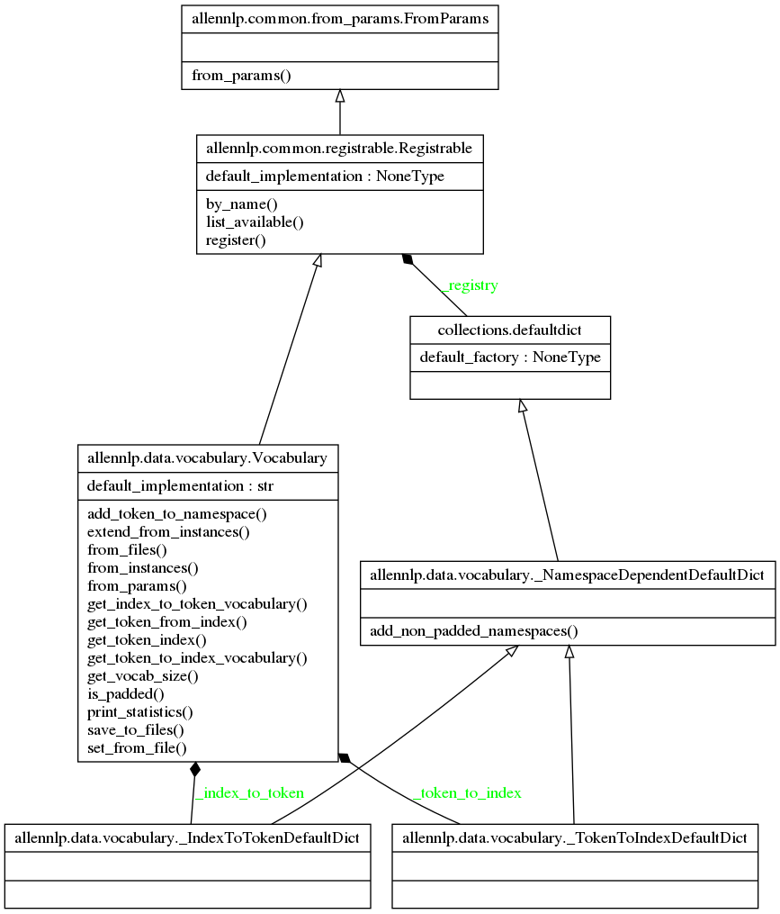
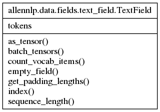
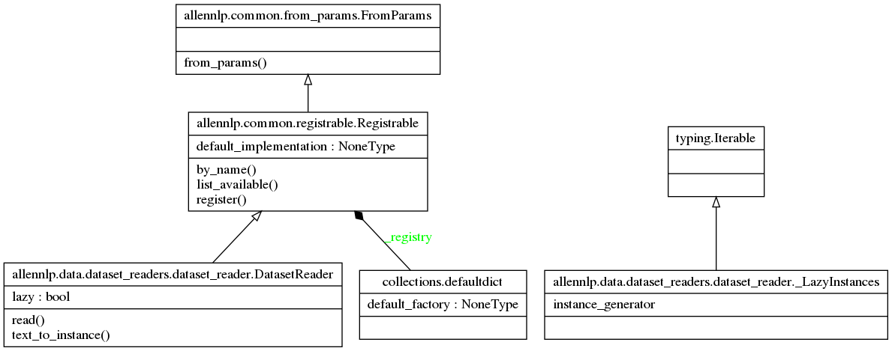
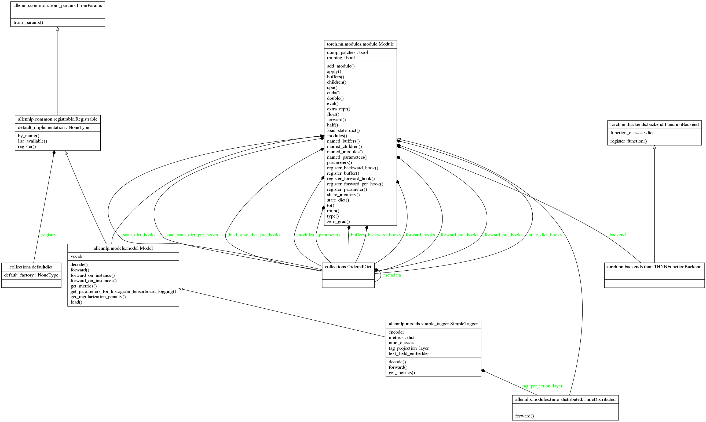

### allennlp/data/vocabulary.py

### allennlp/data/tokenizers/token.py

### allennlp/data/dataset_readers/dataset_reader.py

### allennlp/models/simple_tagger.py

allennlp.data.token_indexers.TokenIndexer
allennlp.data.token_indexers.single_id_token_indexer
allennlp.common.util.get_frozen_and_tunable_parameter_names
allennlp.common.params.Params
allennlp.training.trainer.Trainer
allennlp.models.archival.archive_model
allennlp.data.iterators.data_iterator
allennlp.models.model
allennlp.data.vocabulary
allennlp.data.dataset_reader

## 参考资料
> - 
> - 
