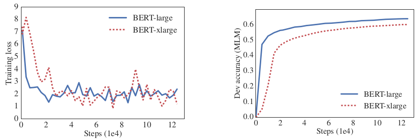
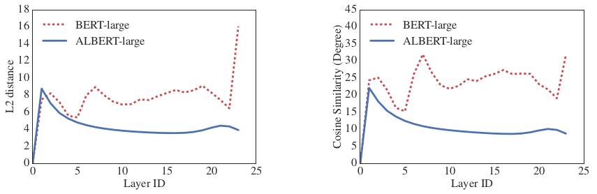

# A LITE BERT FOR SELF-SUPERVISED LEARNING OF LANGUAGE REPRESENTATIONS 小型BERT (自监督学习语言表征)

原文链接: https://openreview.net/pdf?id=H1eA7AEtvS

> ABSTRACT
>
> Increasing model size when pretraining natural language representations often results in improved performance on downstream tasks. However, at some point further model increases become harder due to GPU/TPU memory limitations, longer training times, and unexpected model degradation. To address these problems, we present two parameter-reduction techniques to lower memory consumption and increase the training speed of BERT (Devlin et al., 2019). Comprehensive empirical evidence shows that our proposed methods lead to models that scale much better compared to the original BERT. We also use a self-supervised loss that focuses on modeling inter-sentence coherence, and show it consistently helps downstream tasks with multi-sentence inputs. As a result, our best model establishes new state-of-the-art results on the GLUE, RACE, and SQuAD benchmarks while having fewer parameters compared to BERT-large.

> 摘要 
>
> 在预训练自然语言表示时增加模型大小通常会导致下游任务的性能得到改善。 但是，由于GPU / TPU内存的限制，更长的训练时间以及意外的模型降级，在某些时候，进一步的模型增加变得更加困难。 为了解决这些问题，我们提出了两种参数减少技术，以降低内存消耗并提高BERT的训练速度（Devlin等人，2019）。 全面的经验证据表明，与原始BERT相比，我们提出的方法所导致的模型可扩展性更好。 我们还使用了一个自我监督的损失，该损失专注于模拟句子间的连贯性，并表明它始终可以帮助多句子输入的下游任务。 因此，我们的最佳模型在GLUE，RACE和SQuAD基准测试中建立了最新的结果，而与BERT-large相比，参数却更少。

## 1  INTRODUCTION  介绍

Full network pre-training (Radford et al., 2018; Devlin et al., 2019) has led to a series of breakthroughs in language representation learning. Many nontrivial NLP tasks, including those that have limited training data, have greatly benefited from these pre-trained models. One of the most compelling signs of these breakthroughs is the evolution of machine performance on a reading comprehension task designed for middle and high-school English exams in China, the RACE test (Lai et al., 2017): the paper that originally describes the task and formulates the modeling challenge reports then state-of-the-art machine accuracy at 44.1%; the latest published result reports their model performance at 83.2% (Liu et al., 2019); the work we present here pushes it even higher to 89.4%, a stunning 45.3% improvement that is mainly attributable to our current ability to build high-performance pretrained language representations.

全面的预训练网络（Radford 2018; Devlin 2019）在语言表征学习方面取得了一系列突破。 许多很难的NLP任务，包括那些训练数据有限的任务，都从这些预训练模型中受益匪浅。 这些突破最令人信服的迹象之一是，针对中国的中学和高中英语考试的RACE考试（Lai 2017）设计的阅读理解任务上性能的提升：论文最初描述了 任务并制定建模挑战报告，然后将最新机器的准确性提高到44.1％； 最新公布的结果报告其模型性能为83.2％（Liu等，2019）; 我们在这里所做的工作将其提高到了89.4％，惊人的45.3％的提高，这主要归功于预训练模型高超的语言表征能力。

Evidence from these improvements reveals that a large network is of crucial importance for achieving state-of-the-art performance (Devlin et al., 2019; Radford et al., 2019). It has become common practice to pre-train large models and distill them down to smaller ones (Sun et al., 2019; Turc et al., 2019) for real applications. Given the importance of model size, we ask: Is having better NLP models as easy as having larger models?

这些改进表明，大型网络对于实现最佳性能至关重要（Devlin 2019; Radford 2019）。 预训练大型模型并将其提炼成较小的模型已经成为一种常见的做法（Sun 2019; Turc 2019）以用于实际应用。 考虑到模型大小的重要性，我们问：拥有更好的NLP模型和拥有更大的模型一样容易吗？

An obstacle to answering this question is the memory limitations of available hardware. Given that current state-of-the-art models often have hundreds of millions or even billions of parameters, it is easy to hit these limitations as we try to scale our models. Training speed can also be significantly hampered in distributed training, as the communication overhead is directly proportional to the number of parameters in the model. We also observe that simply growing the hidden size of a model such as BERT-large (Devlin et al., 2019) can lead to worse performance. Table 1 and Fig. 1 show a typical example, where we simply increase the hidden size of BERT-large to be 2x larger and get worse results with this BERT-xlarge model.

回答此问题的障碍是可用硬件的内存限制。 鉴于当前最先进的模型通常具有数亿甚至数十亿个参数，当我们尝试扩展模型时，很容易遇到这些限制。 由于通信开销与模型中参数的数量成正比，因此在分布式训练中，训练速度也可能受到很大的阻碍。 我们还观察到，仅仅增加诸如BERT-large（Devlin 2019）之类的模型的hinden_size可能会导致性能下降。 表1和图1给出了一个典型示例，在该示例中，我们仅将BERT-large的hinden_size增加到2倍，而使用BERT-xlarge模型则得到了较差的结果。

| Model                            | Hidden Size | Parameters | RACE (Accuracy) |
| -------------------------------- | ----------- | ---------- | --------------- |
| BERT-large (Devlin et al., 2019) | 1024        | 334M       | 72.0%           |
| BERT-large(ours)                 | 1024        | 334M       | 73.9%           |
| BERT-xlarge(ours)                | 2028        | 1270M      | 54.3%           |

Table 1: Increasing hidden size of BERT-large leads to worse performance on RACE.

表1：增加BERT-large的hinden_size会导致RACE上的性能变差。

Figure 1: Training loss (left) and dev masked LM accuracy (right) of BERT-large and BERT-xlarge (2x larger than BERT-large in terms of hidden size). The larger model has lower masked LM accuracy while showing no obvious sign of over-fitting.  

图1：BERT-large和BERT-xlarge（hinden_size比BERT-large大2倍）的训练损失（左）和dev遮罩语言模型精度（右）。 较大的模型具有较低的遮罩语言模型的精度，同时没有明显的过拟合迹象。

Existing solutions to the aforementioned problems include model parallelization (Shoeybi et al.,2019) and clever memory management (Chen et al., 2016; Gomez et al., 2017). These solutions address the memory limitation problem, but not the communication overhead and model degradation problem. In this paper, we address all of the aforementioned problems, by designing A Lite BERT (ALBERT) architecture that has significantly fewer parameters than a traditional BERT architecture.

解决上述问题的现有解决方案包括模型并行化（Shoeybi 2019）和聪明的内存管理（Chen 2016; Gomez 2017）。 这些解决方案解决了内存限制问题，但没有解决通信开销和模型性能恶化问题。 在本文中，我们通过设计一种小型BERT(Lite BERT)（ALBERT）架构来解决所有上述问题，该架构的参数比传统BERT架构少得多。

ALBERT incorporates two parameter reduction techniques that lift the major obstacles in scaling pre-trained models. The first one is a factorized embedding parameterization. By decomposing the large vocabulary embedding matrix into two small matrices, we separate the size of the hidden layers from the size of vocabulary embedding. This separation makes it easier to grow the hidden size without significantly increasing the parameter size of the vocabulary embeddings. The second technique is cross-layer parameter sharing. This technique prevents the parameter from growing with the depth of the network. Both techniques significantly reduce the number of parameters for BERT without seriously hurting performance, thus improving parameter-efficiency. An ALBERT configuration similar to BERT-large has 18x fewer parameters and can be trained about 1.7x faster. The parameter reduction techniques also act as a form of regularization that stabilizes the training and helps with generalization.

ALBERT结合了两种参数缩减技术，这些技术可消除缩放预训练模型时的主要障碍。 第一个是分解式词向量参数化。 通过将大的词向量矩阵分解为两个小的矩阵，我们将隐藏层的大小与词向量的大小分开。 这种分隔使得在不显著增加词汇表嵌入参数大小的情况下更容易增加隐藏的大小。 第二种技术是跨层参数共享。 此技术可防止参数随着网络的深度而增长。 两种技术都可以显着减少BERT的参数数量，而不会严重影响性能，从而提高了参数效率。 与BERT-large相似的ALBERT配置参数减少了18倍，并且训练速度快了1.7倍。 参数减少技术还可以充当正则化的一种形式，从而稳定训练并有助于泛化。

To further improve the performance of ALBERT, we also introduce a self-supervised loss for sentence-order prediction (SOP). SOP primary focuses on inter-sentence coherence and is designed to address the ineffectiveness (Yang et al., 2019; Liu et al., 2019) of the next sentence prediction (NSP) loss proposed in the original BERT.

为了进一步提高ALBERT的性能，我们还引入了一种自监督的句子顺序预测损失（SOP）。 SOP主要关注句子间的连贯性，旨在解决原始BERT中提出的下一个句子预测（NSP）丢失的无效性（Yang  2019; Liu 2019）。

As a result of these design decisions, we are able to scale up to much larger ALBERT configurations that still have fewer parameters than BERT-large but achieve significantly better performance. We establish new state-of-the-art results on the well-known GLUE, SQuAD, and RACE benchmarks for natural language understanding. Specifically, we push the RACE accuracy to 89.4%, the GLUE benchmark to 89.4, and the F1 score of SQuAD 2.0 to 92.2.

这些设计的结果是，我们能够扩展到更大的ALBERT配置，该配置的参数仍然比BERT-large的参数少，但性能却明显好于BERT。 我们在著名的GLUE，SQuAD和RACE基准上建立了最新的自然语言理解任务的最佳性能。 具体来说，我们将RACE准确度提高到89.4％，将GLUE基准提高到89.4，将SQuAD 2.0的F1得分提高到92.2。

## 2 RELATED WORK  相关工作

### 2.1 SCALING UP REPRESENTATION LEARNING FOR NATURAL LANGUAGE  提升自然语言的表征学习

Learning representations of natural language has been shown to be useful for a wide range of NLP tasks and has been widely adopted (Mikolov et al., 2013; Le & Mikolov, 2014; Peters et al., 2018; Devlin et al., 2019; Radford et al., 2018; 2019). One of the most significant changes in the last two years is the shift from pre-training word embeddings, whether standard (Mikolov et al., 2013; Pennington et al., 2014) or contextualized (McCann et al., 2017; Peters et al., 2018), to full-network pre-training followed by task-specific fine-tuning (Radford et al., 2018; Devlin et al., 2019). In this line of work, it is often shown that larger model size improves performance. For example, Devlin et al. (2019) show that across three selected natural language understanding tasks, using larger hidden size, more hidden layers, and more attention heads always leads to better performance. However, they stop at a hidden size of 1024. We show that, under the same setting, increasing the hidden size to 2048 leads to model degradation and hence worse performance. Therefore, scaling up representation learning for natural language is not as easy as simply increasing model size.

自然语言表征学习对许多NLP任务有用，并已被广泛采用（Mikolov 2013; Le＆Mikolov，2014; Peters 2018; Devlin 2019 ; Radford 2018; 2019）。过去两年中最重大的变化之一是从预训练词向量转变为标准的（Mikolov 2013; Pennington 2014）或上下文的（McCann 2017; Peters 2018）进行全神经网络预训练，然后进行特定于任务的微调（Radford 2018; Devlin 2019）。在这方面的工作中，经常显示出更大的模型尺寸可以提高性能。例如，Devlin 2019）显示，在三个选定的自然语言理解任务中，使用更大的维度大小，更多隐藏层和更多attention heads 总是可以提高性能。但是，这在1024的维度上失效了。我们表明，在相同设置下，将hidden_size增加到2048会导致模型变弱，从而导致性能下降。因此，提升自然语言的表征学习并不像简单地增加模型大小那样容易。

In addition, it is difficult to experiment with large models due to computational constraints, especially in terms of GPU/TPU memory limitations. Given that current state-of-the-art models often have hundreds of millions or even billions of parameters, we can easily hit memory limits. To address this issue, Chen et al. (2016) propose a method called gradient checkpointing to reduce the memory requirement to be sublinear at the cost of an extra forward pass. Gomez et al. (2017) propose a way to reconstruct each layer’s activations from the next layer so that they do not need to store the intermediate activations. Both methods reduce the memory consumption at the cost of speed. In contrast, our parameter-reduction techniques reduce memory consumption and increase training speed.

此外，由于计算限制，尤其是在GPU / TPU内存限制方面，很难用大型模型进行实验。 鉴于当前最先进的模型通常具有数亿甚至数十亿个参数，我们经常会达到内存限制。 为了解决这个问题，Chen(2016）提出了一种称为梯度检查点的方法，以减少额外的前向传递为代价的亚线性内存需求。 Gomez(2017）提出了一种从下一层重建每个层的激活值的方法，这样它们就不需要存储中间层的激活值。 两种方法都以速度为代价减少了内存消耗。 相反，我们的参数减少技术可减少内存消耗并提高训练速度。

### 2.2 CROSS-LAYER PARAMETER SHARING  跨层参数共享

The idea of sharing parameters across layers has been previously explored with the Transformer architecture (Vaswani et al., 2017), but this prior work has focused on training for standard encoder-decoder tasks rather than the pretraining/finetuning setting. Different from our observations, Dehghani et al. (2018) show that networks with cross-layer parameter sharing (Universal Transformer, UT) get better performance on language modeling and subject-verb agreement than the standard transformer. Very recently, Bai et al. (2019) propose a Deep Equilibrium Model (DQE) for transformer networks and show that DQE can reach an equilibrium point for which the input embedding and the output embedding of a certain layer stay the same. Our observations show that our embeddings are oscillating rather than converging. Hao et al. (2019) combine a parameter-sharing transformer with the standard one, which further increases the number of parameters of the standard transformer.

跨层共享参数的想法以前曾使用Transformer架构进行探讨（Vaswani 2017），但之前的这项工作集中在针对标准编码器-解码器任务的训练上，而不是预训练/微调设置上。 与我们的观察结果不同，Dehghani等人（2018）显示具有跨层参数共享的网络（Universal Transformer，UT）在语言建模和主谓词一致方面比标准Transformer具有更好的性能。 最近，Bai等（2019）提出了针对Transformer的深度均衡模型（DQE），并证明DQE可以达到一个平衡点，对于该平衡点，某层的输入嵌入和输出嵌入保持相同。 我们的观察表明，我们的嵌入是振荡的而不是收敛的。 郝等（2019）将参数共享transformer与标准transformer相结合，这进一步增加了标transformer的参数数量。

2.3  SENTENCE ORDERING OBJECTIVES  句子排序目标任务

ALBERT uses a pretraining loss based on predicting the ordering of two consecutive segments of text. Several researchers have experimented with pretraining objectives that similarly relate to discourse coherence. Coherence and cohesion in discourse have been widely studied and many phenomena have been identified that connect neighboring text segments (Hobbs, 1979; Halliday & Hasan, 1976; Grosz et al., 1995). Most objectives found effective in practice are quite simple. Skip-thought (Kiros et al., 2015) and FastSent (Hill et al., 2016) sentence embeddings are learned by using an encoding of a sentence to predict words in neighboring sentences. Other objectives for sentence embedding learning include predicting future sentences rather than only neighbors (Gan et al., 2017) and predicting explicit discourse markers (Jernite et al., 2017; Nie et al., 2019). Our loss is most similar to the sentence ordering objective of Jernite et al. (2017), where sentence embeddings are learned in order to determine the ordering of two consecutive sentences. Unlike most of the above work, however, our loss is defined on textual segments rather than sentences. BERT (Devlin et al., 2019) uses a loss based on predicting whether the second segment in a pair has been swapped with a segment from another document. We compare to this loss in our experiments and find that sentence ordering is a more challenging pretraining task and more useful for certain downstream
tasks. Concurrently to our work, Wang et al. (2019) also try to predict the order of two consecutive segments of text, but they combine it with the original next sentence prediction in a three-way classification task rather than empirically comparing the two.

ALBERT根据预测两个连续文本段的顺序使用的损失函数。几位研究人员已经尝试过与话语连贯性相似的预训练目标。话语中的连贯性和衔接性已得到广泛研究，并且已发现许多现象将相邻的文本片段连接起来（Hobbs 1979； Halliday＆Hasan 1976； Grosz 1995）。在实践中发现有效的大多数任务目标都非常简单。通过使用句子的编码来预测相邻句子中的单词，可以了解Skip-thought（Kiros 2015）和FastSent（Hill 2016）的句子嵌入。句子嵌入学习的其他目标包括预测未来的句子而不是仅预测相邻（Gan 2017）和预测显式话语标记（Jernite 2017; Nie 2019）。我们的损失与Jernite等人的句子排序目标最相似。 （2017），其中学习句子嵌入以确定两个连续句子的顺序。但是，与上述大多数工作不同，我们的损失是按文本段而不是句子来定义的。 BERT（Devlin 2019）使用损失的依据是预测一对文本片段的第二个片段是否已与另一个文档中的一个片段交换。我们在实验中与这种损失进行了比较，发现句子排序是一项更具挑战性的预训练任务，并且对于某些下游任务更有用。与我们的工作同时，Wang等（2019）也尝试预测文本的两个连续段的顺序，但他们将其与原始的下一句预测结合在三向分类任务中，而不是根据经验对两者进行比较。

## 3  THE ELEMENTS OF ALBERT    模型ALBERT的元素

In this section, we present the design decisions for ALBERT and provide quantified comparisons against corresponding configurations of the original BERT architecture (Devlin et al., 2019).

在本节中，我们介绍了ALBERT的设计思路，并提供了与原始BERT架构的相应配置的量化比较（Devlin 2019）。

### 3.1  MODEL ARCHITECTURE CHOICES  模型结构选择

The backbone of the ALBERT architecture is similar to BERT in that it uses a transformer encoder (Vaswani et al., 2017) with GELU nonlinearities (Hendrycks & Gimpel, 2016). We follow the BERT notation conventions and denote the vocabulary embedding size as E, the number of encoder layers as L, and the hidden size as H. Following Devlin et al. (2019), we set the feed-forward/filter size to be 4H and the number of attention heads to be H/64.

ALBERT架构的主干与BERT相似，因为它使用具有GELU非线性的transformer编码器（Vaswani 2017）（Hendrycks＆Gimpel，2016）。 我们遵循BERT标记约定，将词向量大小表示为E，将编码器层数表示为L，将隐藏大小表示为H。 （2019），我们将前馈/filter的大小设置为4H，attention heads的数量设置为H / 64。

There are three main contributions that ALBERT makes over the design choices of BERT.

ALBERT对BERT的设计选择做出了三点主要贡献。

**Factorized embedding parameterization**. In BERT, as well as subsequent modeling improvements such as XLNet (Yang et al., 2019) and RoBERTa (Liu et al., 2019), the WordPiece embedding size E is tied with the hidden layer size H, i.e., E ≡ H. This decision appears suboptimal for both modeling and practical reasons, as follows.

**分解词向量参数化**。 在BERT中，以及随后的建模改进（例如XLNet（Yang 2019）和RoBERTa（Liu 2019））中，WordPiece嵌入大小E与隐藏层大小H绑定，即E≡H 出于建模和实际原因，此决策似乎次优，如下所示。

From a modeling perspective, WordPiece embeddings are meant to learn context-independent representations, whereas hidden-layer embeddings are meant to learn context-dependent representations. As experiments with context length indicate (Liu et al., 2019), the power of BERT-like representations comes from the use of context to provide the signal for learning such context-dependent representations. As such, untying the WordPiece embedding size E from the hidden layer size H allows us to make a more efficient usage of the total model parameters as informed by modeling needs, which dictate that H >> E.

从建模角度看，WordPiece嵌入旨在学习上下文无关的表征，而隐藏层嵌入旨在学习上下文相关的表征。 正如上下文长度的实验所表明的那样（Liu 2019），类似BERT的表征的力量来自上下文的使用，以提供学习此类依赖于上下文的表征的信号。 这样，将WordPiece嵌入大小E与隐藏层大小H脱开，可以使我们更有效地利用建模所需的总模型参数，这表明H >> E。

From a practical perspective, natural language processing usually require the vocabulary size V to be large. 1 If E ≡ H, then increasing H increases the size of the embedding matrix, which has size V × E. This can easily result in a model with billions of parameters, most of which are only updated sparsely during training.

从实践的角度来看，自然语言处理通常要求词汇量V很大。 ① 如果E≡H，则增加H会增大嵌入矩阵的大小，该矩阵的大小为V×E。这很容易形成具有数十亿个参数的模型，其中大多数参数仅在训练期间稀疏更新。

Therefore, for ALBERT we use a factorization of the embedding parameters, decomposing them into two smaller matrices. Instead of projecting the one-hot vectors directly into the hidden space of size H, we first project them into a lower dimensional embedding space of size E, and then project it to the hidden space. By using this decomposition, we reduce the embedding parameters from O(V × H) to O(V × E + E × H). This parameter reduction is significant when H >> E.

因此，对于ALBERT，我们使用嵌入参数的分解，将它们分解为两个较小的矩阵。 与其直接将onehot向量投影到大小为H的隐藏空间中，不如将它们投影到大小为E的低维嵌入空间中，然后将其投影到隐藏空间中。 通过这种分解，我们将嵌入参数从O（V×H）减少到O（V×E + E×H）。 当H >> E时，此参数减小非常明显。

**Cross-layer parameter sharing**. For ALBERT, we propose cross-layer parameter sharing as another way to improve parameter efficiency. There are multiple ways to share parameters, e.g., only sharing feed-forward network (FFN) parameters across layers, or only sharing attention parameters. The default decision for ALBERT is to share all parameters across layers. We compare this design decision against other strategies in our experiments in Sec. 4.5.

**跨层参数共享**。 对于ALBERT，我们提出了跨层参数共享作为提高参数效率的另一种方法。 有多种共享参数的方法，例如，仅跨层共享前馈网络（FFN）参数，或仅共享attention参数。 ALBERT的默认决定是跨层共享所有参数。 在本节的实验中，我们将此设计决策与其他策略进行了比较。 4.5。

Similar strategies have been explored by Dehghani et al. (2018) (Universal Transformer, UT) and Bai et al. (2019) (Deep Equilibrium Models, DQE) for Transformer networks. Different from our observations, Dehghani et al. (2018) show that UT outperforms a vanilla Transformer. Bai et al. (2019) show that their DQEs reach an equilibrium point for which the input and output embedding of a certain layer stay the same. Our measurement on the L2 distances and cosine similarity show that our embeddings are oscillating rather than converging.

Dehghani等人也探索了类似的策略（2018）（Universal Transformer，UT）和Bai等人（2019）（Deep Equirbrium Models，DQE）for Transformer network。 与我们的观察结果不同，Dehghani等人（2018）显示UT的性能优于vanilla Transformer。 Bai等（2019）表明，他们的DQE达到了一个平衡点，对于该平衡点，特定层的输入和输出嵌入保持不变。 我们对L2距离和余弦相似度的测量表明，我们的嵌入是振荡的而不是收敛的。

Figure 2: The L2 distances and cosine similarity (in terms of degree) of the input and output embedding of each layer for BERT-large and ALBERT-large.

图2：对于BERT-large和ALBERT-large，每层输入和输出嵌入的L2距离和余弦相似度（以度为单位）。

Figure 2 shows the L2 distances and cosine similarity of the input and output embeddings for each layer, using BERT-large and ALBERT-large configurations (see Table 2). We observe that the transitions from layer to layer are much smoother for ALBERT than for BERT. These results show that weight-sharing has an effect on stabilizing network parameters. Although there is a drop for both metrics compared to BERT, they nevertheless do not converge to 0 even after 24 layers. This shows that the solution space for ALBERT parameters is very different from the one found by DQE.

图2显示了使用BERT-large和ALBERT-large配置的每一层输入和输出嵌入的L2距离和余弦相似度（参见表2）。 我们观察到，与BERT相比，ALBERT从一层到另一层的过渡要平滑得多。 这些结果表明，权重共享对稳定网络参数有影响。 尽管与BERT相比，这两个指标都有所下降，但是即使经过24层，它们也不会收敛为0。 这表明ALBERT参数的解决方案空间与DQE发现的空间有很大不同。

| Model  | type    | Parameters | Layers | Hidden | Embedding | Parameter-sharing |
| ------ | ------- | ---------- | ------ | ------ | --------- | ----------------- |
| BERT   | base    | 108M       | 12     | 768    | 768       | FALSE             |
| BERT   | large   | 334M       | 24     | 1024   | 1024      | FALSE             |
| BERT   | xlarge  | 1270M      | 24     | 2048   | 2048      | FALSE             |
| ALBERT | base    | 12M        | 12     | 768    | 128       | TRUE              |
| ALBERT | large   | 18M        | 24     | 1024   | 128       | TRUE              |
| ALBERT | xlarge  | 59M        | 24     | 2048   | 128       | TRUE              |
| ALBERT | xxlarge | 233M       | 12     | 4096   | 128       | TRUE              |

**Inter-sentence coherence loss**. In addition to the masked language modeling (MLM) loss (Devlin et al., 2019), BERT uses an additional loss called next-sentence prediction (NSP). NSP is a binary classification loss for predicting whether two segments appear consecutively in the original text, as follows: positive examples are created by taking consecutive segments from the training corpus; negative examples are created by pairing segments from different documents; positive and negative examples are sampled with equal probability. The NSP objective was designed to improve performance on downstream tasks, such as natural language inference, that require reasoning about
the relationship between sentence pairs. However, subsequent studies (Yang et al., 2019; Liu et al., 2019) found NSP’s impact unreliable and decided to eliminate it, a decision supported by an improvement in downstream task performance across several tasks.

**句子间连贯性损失**。 除了遮罩语言建模（MLM）损失（Devlin 2019）之外，BERT还使用了另一种损失，称为下一句预测（NSP）。 NSP是一种二分类损失，用于预测原始文本中是否有两个片段连续出现，如下所示：通过从训练语料库中获取连续片段来创建正样本；负样本是通过将来自不同文档的句段配对而创建的； 正样本和负样本均以相同的概率采样。 NSP目标旨在提高需要推理的下游任务性能, （例如自然语言推断）的句子对之间的关系。 然而，随后的研究（Yang 2019; Liu 2019）发现NSP的影响不可靠，因此决定消除它，这一决定得到了多项任务下游任务性能的改善的支持。

## 参考资料
> - 
> - 

