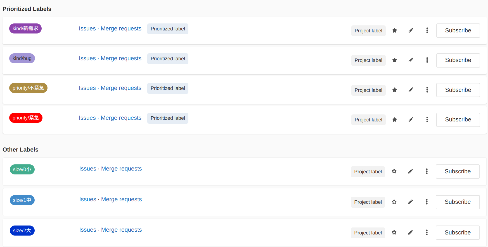
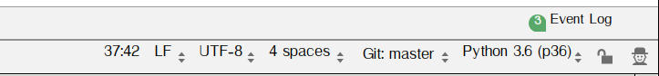

# gitlab使用

### 设置保护分支(master分支不能推送)

> 默认的master分支是收保护的，不能直接push

进入setting--->Repository--->Protected Branches   设置保护分支


### 设置issue模板

在项目repository的代码文件夹新建一个文件夹:   ```.gitlab```

.gitlab/.gitkeep  (空文本)

```bash

```

.gitlab/issue_templates  文件夹

.gitlab/issue_templates/.gitkeep  (空文本)

```bash

```

.gitlab/issue_templates/bug.md

```md
#### 系统信息（代码版本等）


#### 重现步骤


#### 期望结果


#### 报错信息


```

.gitlab/issue_templates/feature.md

```md
#### 要解决什么问题


#### 要实现什么样的功能


#### 用户的应用场景是什么样的


#### 注意事项（用户可能有哪些骚操作，等等）


#### 对现有功能有什么影响


#### 依赖什么模块


```


### labels配置



kind（类型）

- kind/bug
- kind/新需求

priority（优先级）

- priority/紧急
- priority/不紧急

size（工作量）：表示 issue 需要大约花费多少时间/精力，可以用来做简单的工作量评估参考。 

- size/0小
- size/1中
- size/2大


### CRLF/LF/CR

#### 三种换行模式：

| 模式 | 操作系统 | 缩写 |
| ---- | -------- | ---- |
| CRLF | windows  | \n\r |
| CR   | mac OSX  | \r   |
| LR   | Linux    | \n   |

#### pycharm可以在状态栏显示换行符使用的模式，如下图：



点击  LF 可以切换文件的换行模式

#### git--AutoCRLF

```bash
#提交时转换为LF，检出时转换为CRLF
git config --global core.autocrlf true   #windows推荐方式

#提交时转换为LF，检出时不转换
git config --global core.autocrlf input   

#提交检出均不转换
git config --global core.autocrlf false   #Linux/Mac推荐方式
```

#### SafeCRLF

```bash
#拒绝提交包含混合换行符的文件
git config --global core.safecrlf true    #推荐方式

#允许提交包含混合换行符的文件
git config --global core.safecrlf false   

#提交包含混合换行符的文件时给出警告
git config --global core.safecrlf warn
```


