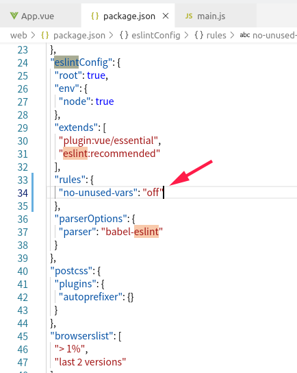

.

## 安装相关软件

```bash
# 安装vue脚手架
sudo npm install -g @vue/cli    
```

[vue-cli官方文档](https://cli.vuejs.org/zh/)

## 初始化一个vue项目文件夹

```bash
vue create hello   # 创建的文件夹叫hello  (注意: 该博客下把这个文件夹叫做"root" 便于记录)

首先，会提示你选择一个preset（预设）：

① 除最后两个，其他选项都是你此前保存的预设配置（如下图第一个“ preset-config”是我之前保存的预设配置，如今便可以直接用了）：

如果没有配置保存过，则只有以下两个选项：

② default（babel，eslint）：

默认设置（直接enter）非常适合快速创建一个新项目的原型，没有带任何辅助功能的 npm包

③ Manually select features：

? Check the features needed for your project: (Press <space> to select, <a> to toggle all, <i> to invert selection)
>( ) Babel                           //转码器，可以将ES6代码转为ES5代码，从而在现有环境执行。                      
 ( ) TypeScript// TypeScript是一个JavaScript（后缀.js）的超集（后缀.ts）包含并扩展了 JavaScript 的语法，需要被编译输出为 JavaScript在浏览器运行，目前较少人再用
 ( ) Progressive Web App (PWA) Support// 渐进式Web应用程序
 ( ) Router                           // vue-router（vue路由）
 ( ) Vuex                             // vuex（vue的状态管理模式）
 ( ) CSS Pre-processors               // CSS 预处理器（如：less、sass）
 ( ) Linter / Formatter               // 代码风格检查和格式化（如：ESlint）
 ( ) Unit Testing                     // 单元测试（unit tests）
 ( ) E2E Testing                      // e2e（end to end） 测试

cd hello
npm run serve   # 启动静态服务器 可以进行测试
npm run build   # 打包静态文件
```


## 项目配置文件: package.json 

1. scripts: 配置命令, 例如build 和 serve  (通过npm run xxx 执行)

## 入口文件: main.js

```js
import App from './App.vue'     # './App.vue' 是主页, 文件在   root/src/ 之下寻找
```


## 常见报错

### xxx defined but never used

是eslint的格式检查太严格了,  找到```package.json```增加rule, 关闭这个检查即可, 增加如下规则:

```bash
"no-unused-vars": "off"
```




## 参考资料
> - []()
> - []()  
