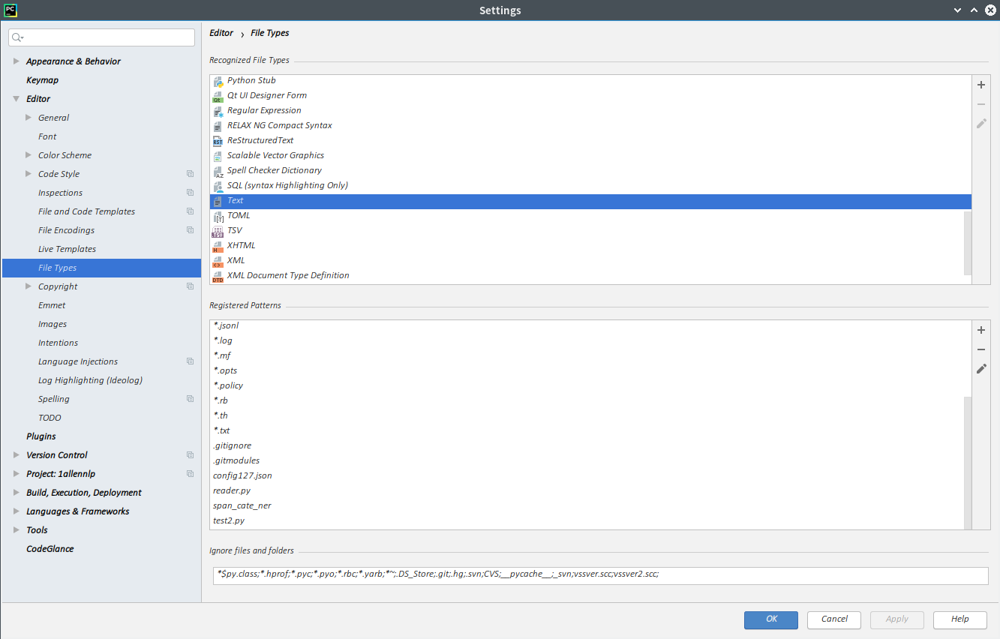

## 配置

### 常用代码片段配置

****

>  配置路径   Setting--->Editor--->Live Templates--->加号按钮

```python
# ~err
error = '\n'.join(traceback.format_exception(*sys.exc_info()))

# ~root
def root(*f, relative_root='../../../'):
    # relative_root 当前代码目录相对root的相对路径
    for t in f:
        if t[:1] == '/':
            print('Warning: root()包含绝对路径 参数={}'.format(f))
            break
    code_dir = os.path.dirname(os.path.realpath(__file__))
    long_path = os.path.join(code_dir, relative_root, *f)
    return long_path
```

### 快捷键配置

Keymap---方案设置成NetBeans

| 名称               | 快捷键             | 说明               |
| ------------------ | ------------------ | ------------------ |
| Reformat           | Ctrl+Alt+L  需设置 | Code格式化代码     |
| Move Line Up       | Alt+Up  需设置     | 当前行往上挪一行   |
| Move Line Down     | Alt+Down  需设置   | 当前行往上挪一行   |
| Optimize Imports   | Ctrl+Shift+I       | 优化导入代码       |
|                    | Ctrl+F12           | 跳转到方法（列表） |
|                    | Ctrl + F11         | 设置书签           |
|                    |                    |                    |
|                    | SHIFT F11          | 显示所有书签       |
| Go to Bookmark 1   | Ctrl+Alt+1  需设置 | 跳转到 该书签      |
| Next Bookmark      | Ctrl+Shift+.       | 跳转到下个书签     |
| Previous Bookmark  | Ctrl+Shift+逗号    | 跳转到上个书签     |
| Decrease Font Size | Ctrl+Alt+减号      | 减小字体大小       |
| Increase Font Size | Ctrl+Alt+=         | 增加字体大小       |
|                    |                    |                    |
|                    |                    |                    |
|                    |                    |                    |
|                    |                    |                    |
|                    |                    |                    |
|                    |                    |                    |


### 跳转到上个光标所在位置

​	打开 View---toolbar   有左右箭头按钮。悬停可以查看快捷键


### 插件

File---Setting---Plugins

数据库插件：

​	搜索datebase

​		安装 Database Navigator

​		~~安装Mongo Plugin~~

​	Grep Console 控制台文本颜色

默认logger的stream是输出到sys.stderr, 这是pycharm会把文字设置成红色. 如果设置stream到sys.stdout, 字体颜色就正常了

​	

### 显示界面和字体配置

```bash
界面的字体大小：
Setting-->Appearance&Behavior-->Appearance-->Use custom font

代码的字体大小：
Setting-->Editor-->Font

控制台的字体大小:
Setting-->Editor-->Color Scheme-->Console Font
```

## 常见BUG

### pycharm中所有代码无法自动提示处理方法

**解决方案：** 
1）打开pycharm后必须等待indexing全部结束； 
2）检查file菜单里，确保节能模式“power save mode”不被勾选。

### 某个文件不能代码高亮

原因: 自动识别成了text文件(误操作添加了文件类型)

解决方案:

设置--->Editor--->File Types--->找到文件名删除(一般在Text里面)



## 参考资料

> - []()
> - []()
