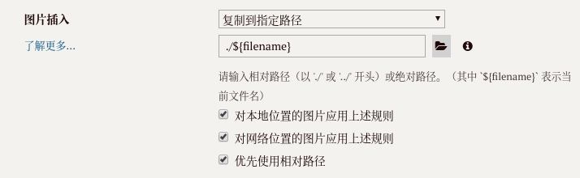

## 安装hexo

```bash
sudo npm install hexo-cli -g
```

## 图片显示

```bash
# 配置资源文件夹
# hexo n xxx 会生成同名文件夹,
# hexo g 会把同名文件夹内图片打包生成静态文件
_config.yml里的post_asset_folder，改成true

# 安装插件
npm install hexo-asset-image --save

# 设置typora编辑器
# 图片插入路径= ./${filename}
# 优先使用相对路径
在typora编辑器内粘贴图片时会自动把图片存储到同名文件夹
```



## 主题配置

[hexo-theme-Wikitten Github地址](https://github.com/zthxxx/hexo-theme-Wikitten/blob/master/README_zh-CN.md)

## 部署hexo

```bash
# 进入blog目录
hexo init
# 启动服务器
hexo server
hexo server -p 8080  # -p 端口

# 生成静态文件
hexo generate   | hexo g
`
```

## 插件

### 自动生存目录树 categories

[hexo-auto-category](https://github.com/xu-song/hexo-auto-category)

```bash
# 安装
npm install hexo-auto-category --save

# 在站点根目录下的_config.yml添加：
# 自动生成目录树categories (depth层级上限)
auto_category:
 enable: true
 depth:
 
# 使用
hexo clean && hexo g && hexo d
```

## 绑定域名

```bash
A (Address) 记录是域名到ip的映射，即为ip起别名
CNAME是域名别名到域名的映射，即为域名起别名。

政策导致国内无法绑定到github~~
```


## 参考资料
> - [Hexo 的个人 Wiki 主题 - Wikitten](https://blog.zthxxx.me/posts/Personal-Wiki-System-Theme-for-Hexo/)
> - [hexo-theme-Wikitten github地址](https://github.com/zthxxx/hexo-theme-Wikitten)
> - [hexo中文官方文档](https://hexo.io/zh-cn/)
