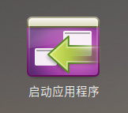
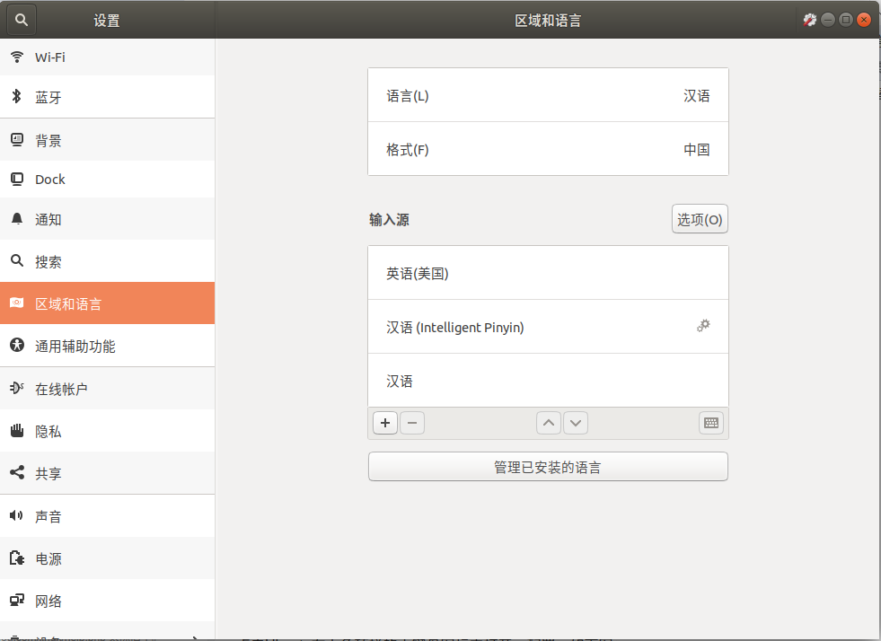
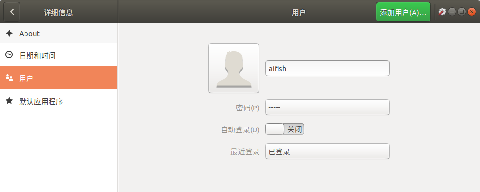
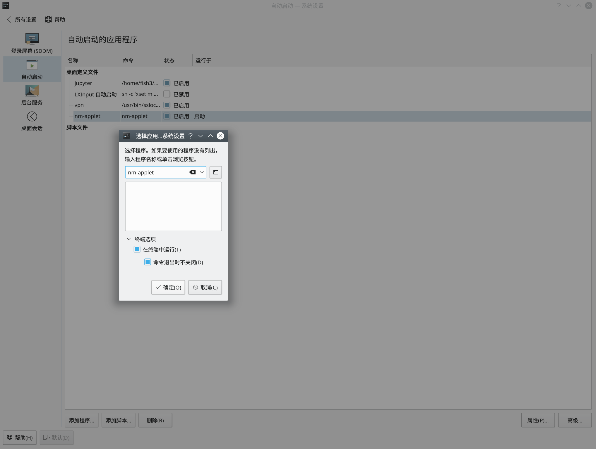
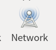
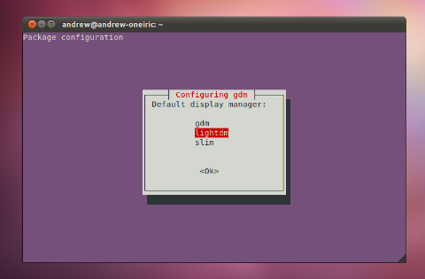

## 零 安装kernel（修复界面卡顿问题）

问题：4.18版本kernel的CPU核心显卡存在bug，会导致界面卡顿

解决：安装5.1版本kernel（不要安装最新的rc版本，稳定一些）

查看当前内核版本

```bash
# 查看当前内核版本
uname -r
>>>4.18.0-20-generic

# 搜索可用的内核
apt-cache showpkg linux-headers
apt-cache showpkg linux-image
找到这两个命令里，版本号相同的最新版本

# 示例：选择5.1.0版本
sudo apt install linux-headers-5.1.0-050100-generic linux-image-unsigned-5.1.0-050100-generic --fix-missing
```


## 一 安装系统


### 安装thefuck

```bash
sudo apt install thefuck

thefuck -a f   # 获取alias文本， 别名=f（可以自己设定）
把alias文本设置到.bashrc内
```

### 安装tldr （太长不看，查看linux命令行帮助信息的工具）

```bash
sudo pip install tldr
# 查看tar的帮助信息
tldr tar
```


### 安装docker

```bash
sudo apt install docker.io


# 创建文件  /etc/docker/daemon.json  增加私有镜像仓库
{
    "insecure-registries" : ["192.168.31.103:5000"]
}

sudo systemctl restart docker

```


### 制作启动盘

```bash
# 查看硬盘列表
sudo fdisk -l

# 结果依次显示每个硬盘的信息，可知 /dev/sdb就是优盘
Disk /dev/nvme0n1：232.9 GiB，250059350016 字节，488397168 个扇区
Disk model: Samsung SSD 970 EVO 250GB               
单元：扇区 / 1 * 512 = 512 字节
扇区大小(逻辑/物理)：512 字节 / 512 字节
I/O 大小(最小/最佳)：512 字节 / 512 字节
磁盘标签类型：gpt
磁盘标识符：C56964F0-A438-4609-8521-BB80B61A498F

设备                起点      末尾      扇区   大小 类型
/dev/nvme0n1p1 109258752 488392031 379133280 180.8G Linux 文件系统
/dev/nvme0n1p2   4196352   4401151    204800   100M Linux 文件系统
/dev/nvme0n1p3   4401152 109258751 104857600    50G Linux 文件系统
/dev/nvme0n1p4      2048    616447    614400   300M EFI 系统
/dev/nvme0n1p5    616448   4196351   3579904   1.7G Linux swap

分区表记录没有按磁盘顺序。


Disk /dev/sda：1.8 TiB，2000398934016 字节，3907029168 个扇区
Disk model: WDC WD20EZAZ-00G
单元：扇区 / 1 * 512 = 512 字节
扇区大小(逻辑/物理)：512 字节 / 4096 字节
I/O 大小(最小/最佳)：4096 字节 / 4096 字节
磁盘标签类型：gpt
磁盘标识符：B6164008-B283-4767-831C-8784AB8854F7

设备            起点       末尾       扇区   大小 类型
/dev/sda1       2048  835022847  835020800 398.2G Linux 文件系统
/dev/sda2  835022848 3907024031 3072001184   1.4T Linux 文件系统


Disk /dev/sdb：14.4 GiB，15483273216 字节，30240768 个扇区
Disk model: DataTraveler 2.0
单元：扇区 / 1 * 512 = 512 字节
扇区大小(逻辑/物理)：512 字节 / 512 字节
I/O 大小(最小/最佳)：512 字节 / 512 字节
磁盘标签类型：dos
磁盘标识符：0x3fbeba85

设备       启动    起点    末尾    扇区  大小 Id 类型
/dev/sdb1  *          0 4774783 4774784  2.3G  0 空
/dev/sdb2       4774784 4929791  155008 75.7M  1 FAT12

# 创建启动盘： if=镜像文件   of=优盘盘符路径
sudo dd if=/home/fish/下载/deepinamd64.iso of=/dev/sdb
```


## 二 安装软件

```bash
卸载软件

命令： apt-get remove softname1 softname2 softname3……

卸载并清除配置

命令： apt-get remove --purge softname1
更新软件信息数据库

命令： apt-get update

进行系统升级

命令： apt-get upgrade

搜索软件包

命令： apt-cache search softname1 softname2 softname3……
安装deb软件包

命令： dpkg -i xxx.deb

删除软件包

命令： dpkg -r xxx.deb
连同配置文件一起删除

命令： dpkg -P xxx.deb  (purge)
查看软件包信息

命令： dpkg -info xxx.deb

查看文件拷贝详情

命令： dpkg -L xxx.deb

查看系统中已安装软件包信息

命令： dpkg -l

重新配置软件包

命令： dpkg-reconfigure xxx
```

### 科学上网

```bash
# 安裝ss的命令行工具
sudo apt install shadowsocks
sslocal -c xxx.json

# 浏览器安装科学插件
# 找到chrome执行程序目录，加代理启动，安装 SwitchyOmega插件
./chrome --proxy-server='socks5://127.0.0.1:1080'
```



开机启动：打开“启动应用程序”添加命令```/usr/bin/sslocal -c ///xxx.json```

其中命令和配置文件需要全局路径


### 设置开机自启动的内容

```bash
#　建立 /etc/systemd/system/rc-local.service　文件内容如下：
_________________________________________________
[Unit]
Description=/etc/rc.local Compatibility
ConditionPathExists=/etc/rc.local
 
[Service]
Type=forking
ExecStart=/etc/rc.local start
TimeoutSec=0
StandardOutput=tty
RemainAfterExit=yes
SysVStartPriority=99
 
[Install]
WantedBy=multi-user.target
_________________________________________________

# 创建启动命令脚步文件 /etc/rc.local
——————————————————————————————————————————————————
#!/bin/sh -e
echo "看到这行字，说明添加自启动脚本成功。" > /usr/local/test.log
exit 0
——————————————————————————————————————————————————
# 添加权限
sudo chmod +x /etc/rc.local

# 开机启动服务
sudo systemctl enable rc-local
# 启动服务并检查状态
sudo systemctl start rc-local.service
sudo systemctl status rc-local.service
# 修改service配置文件后，重载
sudo systemctl daemon-reload
# 查看日志
cat /usr/local/test.log　　
```

开启ssh服务

```bash
sudo apt install openssh-server
sudo systemctl restart sshd

# 设置不允许root帐号登录 修改文件 /etc/ssh/sshd_config
	PermitRootLogin no
# 重启sshd服务
sudo systemctl restart sshd
sudo systemctl enable sshd
```


### 安装git git-lfs

```bash
# 安装git
sudo apt install git

# 安装git-lfs ########### ubuntu
## 1. 设置url源
curl -s https://packagecloud.io/install/repositories/github/git-lfs/script.deb.sh | sudo bash
## 2. 安装lfs
sudo apt-get install git-lfs
## 3. 初始化
git lfs install

```

### 安装google输入法(不好用)

```bash
sudo  apt-get install fcitx-googlepinyin
然后注销再登陆操作系统
```

### 安装搜狗输入法




```bash
1. 去搜狗拼音官网,下载linux版本安装文件(.deb)
2. 双击打开界面安装
3. 登出后登录操作系统
4. 右键点击顶栏的键盘图标，选择配置
5. 添加搜狗输入法

如果候选栏显示乱码、无法显示中文，可按如下方式处理：
1. 如果是刚装完搜狗输入法,则输入命令:sudo apt-get install -f,进行依懒性检查,判断是否却是依赖项.
2. 如果是之前一直可以输入中文的,突然无法输入,则不是依赖项的问题,此时输入命令:killall fcitx
3.如果2仍不能解决问题,则删除配置文件,Ubuntu下搜狗的配置文件在~/.config下的3个文件夹里：SogouPY、SogouPY.users、sogou-qimpanel   删除这3个文件夹,然后重启搜狗即可.
```


### 安装zsh 和 autojump

```bash
sudo apt install zsh

sh -c "$(curl -fsSL https://raw.github.com/robbyrussell/oh-my-zsh/master/tools/install.sh)"

重启操作系统后终端变成zsh
如果要切换回去bash
chsh -s /bin/bash

# 安裝autojump
git clone git://github.com/wting/autojump.git
cd autojump
./install.py or ./uninstall.py
手工把提示腳本添加到 ~/.zshrc
```

### 安装WPS

去wps官网下载deb文件，双击后安装。

然后下载font文件：链接如下

[国内地址](https://link.jianshu.com/?t=http%3A%2F%2Fpan.baidu.com%2Fs%2F1mh0lcbY)

[国外地址](https://link.jianshu.com/?t=https%3A%2F%2Fwww.dropbox.com%2Fs%2Flfy4hvq95ilwyw5%2Fwps_symbol_fonts.zip)

```bash
#a. 将得到文件复制到/usr/share/fonts
sudo cp * /usr/share/fonts
#b. 执行以下命令,生成字体的索引信息
sudo mkfontscale
sudo mkfontdir
#c. 更新字体缓存
sudo fc-cache
```

### 安装node/npm

```bash
# 1. 安装默认版本
sudo apt-get install npm
# 2. 安装版本管理工具
sudo npm install -g n
# 3. 安装对应版本
sudo n latest   #最新版本
sudo n stable   #最新的稳定版本
```


### 安装ssh服务

```bash
sudo apt install openssh-server
sudo systemctl start sshd
sudo vim /etc/ssh/sshd_config # 关闭root用户登录
PermitRootLogin no

sudo systemctl restart sshd

wangxiaoyu@dc5:~$ ssh xxxxx@192.168.31.68
@@@@@@@@@@@@@@@@@@@@@@@@@@@@@@@@@@@@@@@@@@@@@@@@@@@@@@@@@@@
@    WARNING: REMOTE HOST IDENTIFICATION HAS CHANGED!     @
@@@@@@@@@@@@@@@@@@@@@@@@@@@@@@@@@@@@@@@@@@@@@@@@@@@@@@@@@@@
IT IS POSSIBLE THAT SOMEONE IS DOING SOMETHING NASTY!
Someone could be eavesdropping on you right now (man-in-the-middle attack)!
It is also possible that a host key has just been changed.
The fingerprint for the ECDSA key sent by the remote host is
SHA256:yHxBrXIZ6upZaOPDf3PcaOO+aaEthNQiw4O4CCt7gSM.
Please contact your system administrator.
Add correct host key in /home/wangxiaoyu/.ssh/known_hosts to get rid of this message.
Offending ECDSA key in /home/wangxiaoyu/.ssh/known_hosts:14
  remove with:
  ssh-keygen -f "/home/usr1/.ssh/known_hosts" -R 192.168.31.68
  
目标ssh服务器重装系统后，远程登录时会报错。使用报错信息里的remove with 后面的命令即可清除报错
ssh-keygen -f "/home/usr1/.ssh/known_hosts" -R 192.168.31.68
```

### 安装chrome

```bash
sudo wget http://www.linuxidc.com/files/repo/google-chrome.list -P /etc/apt/sources.list.d/

wget -q -O - https://dl.google.com/linux/linux_signing_key.pub  | sudo apt-key add -

sudo apt update

sudo apt install google-chrome-stable
```

### 安装deepin的百度云、截图和终端

```bash
# 百度云  安装失败！
https://gitee.com/wszqkzqk/deepin-wine-for-ubuntu

# 截图、深度终端
在ubuntu软件上级
搜索   dee
```

### 安装和挑选终端

```bash
sudo apt install xfce4-terminal
terminator   #gnome
konsole
```


### 配置Gnome界面

```bash
sudo apt install chrome-gnome-shell
sudo apt install gnome-tweak-tool
打开Ubuntu软件商店安装：GNOME Tweaks
https://extensions.gnome.org/   账号aifish f1

使用火狐浏览器安装插件
```

使用chrome打开：


使用火狐打开：


点击安装插件 [Click here to install browser extension](https://extensions.gnome.org/#)

#### 安装gnome插件

User Themes 

[Clipboard Indicator topbar剪贴板列表](https://extensions.gnome.org/extension/779/clipboard-indicator/)

[Recent Items  topbar最近文件夹](https://extensions.gnome.org/extension/72/recent-items/)

[Places Status Indicator   topbar文件夹收藏](https://extensions.gnome.org/extension/8/places-status-indicator/)

[Datetime Format topbar显示日期   配置格式：%b-%d     %A   %R](https://extensions.gnome.org/extension/1173/datetime-format/)


#### 快捷键设置

| 快捷键  | 配置路径                | 说明       |
| ------- | ----------------------- | ---------- |
| Super+E | 启动器---主目录         | 文件管理器 |
|         |                         |            |
| Super+D | 导航---隐藏所有正常窗口 | 回到桌面   |
| Super+W | 启动网页浏览器          |            |
|         |                         |            |
|         |                         |            |

#### 设置开机时自动登录

设置---详细信息---用户---自动登录



### alias配置

```bash
alias get1='pip install -i https://pypi.tuna.tsinghua.edu.cn/simple/ '
alias get2='pip install -i http://mirrors.aliyun.com/pypi/simple/ '
alias get3='pip install -i https://pypi.douban.com/simple/ '
```


### KDE界面

#### 安装

```bash
sudo apt install plasma-desktop
```
#### 开机自启动

系统设置－－－＞工作空间－－－＞开机和关机－－－＞自动启动

（勾选：在终端中运行）



#### 界面设置

```bash
# 关闭: 自动锁屏时间
系统设置--->工作空间--->桌面行为--->锁屏(快捷键)
# 快捷键
系统设置--->工作空间--->快捷键
```

#### 没有无线网络选择图标

```bash
开机自启动增加:
nm-applet
```

程序图标：


### xfce界面

#### 安装

```bash
sudo apt-get install xfce4 
注销当前账号
在输入密码界面，选择不同的界面系统
```


### LXDE界面

**致命缺陷:  不能设置屏幕缩放, 对于高分辨率屏幕太不方便**

安装

```bash
LXDE有很多定制版，可任选
# Lubuntu定制LXDE和vanilla LXDE（实际安装不成功，缺少依赖）
# sudo apt-get install lubuntu-desktop
# 香草LXDE
sudo apt-get install lxde
# 选择使用lightdm（见图）  （gdm3 快捷键报错cannot configure keys remotely）
如果设置错了也可以切换lightdm
sudo dpkg-reconfigure lightdm  # sudo dpkg-reconfigure gdm3
 
```



#### 设置数字时钟格式：%b-%d     %A   %R

#### 设置快捷键：菜单---首选项---set hot key

| 功能       | 快捷键           | 说明                                                |
| ---------- | ---------------- | --------------------------------------------------- |
| 文件管理器 | Win+E            | 默认有  nautilus --new-window                       |
| 显示桌面   | Win+D            | 默认有                                              |
| 锁屏       | Win+L            | lxlock                                              |
| 打开浏览器 | Win+W            | browser360  或  /usr/bin/google-chrome-stable       |
| 打开终端   | Win+T            | lxterminal  或  deepin-terminal  或  gnome-terminal |
| vscode     | Win+V            | code                                                |
| pycharm    | Win+P            | 打开pycharm--Tools--Create CMD line                 |
| typora     | Win+M            | typora                                              |
| 截图       | Ctrl+Shift+Print | deepin-screenshot                                   |
|            |                  |                                                     |
|            |                  |                                                     |
|            |                  |                                                     |


## 参考资料

> - []()
> - []()
