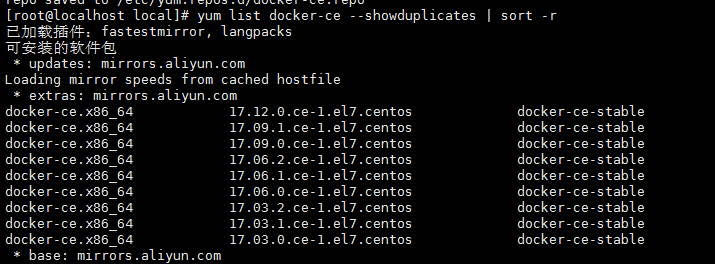

## 安装docker

```bash
# 使用 root 权限登录 Centos
su
#  yum 包更新到最新。
yum update

# 卸载旧版本(如果安装过旧版本的话)
yum remove docker  docker-common docker-selinux docker-engine
# 安装需要的软件包， yum-util 提供yum-config-manager功能，另外两个是devicemapper驱动依赖的
yum install -y yum-utils device-mapper-persistent-data lvm2
# 设置yum源
yum-config-manager --add-repo https://download.docker.com/linux/centos/docker-ce.repo
# 可以查看所有仓库中所有docker版本，并选择特定版本安装
yum list docker-ce --showduplicates | sort -r
[结果见下图]

# 安装docker
yum install docker-ce  #由于repo中默认只开启stable仓库，故这里安装的是最新稳定版17.12.0
yum install <FQPN>  # 例如：sudo yum install docker-ce-17.12.0.ce

# 启动并加入开机启动
systemctl start docker
systemctl enable docker

# 验证安装是否成功(有client和service两部分表示docker安装启动都成功了)
docker version
```




## 参考资料
> - []()
> - []()
