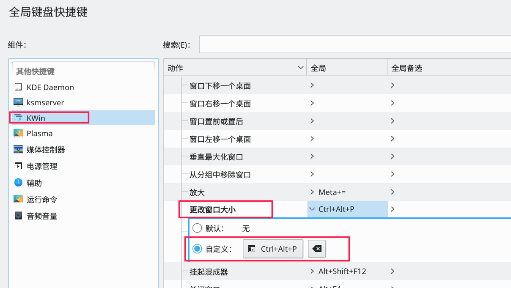

### tty终端

```bash
# 进入tty终端
Ctrl+Alt+F1   到F6  进入tty1～～tty6
# 从tty回到桌面环境
Ctrl+Alt+F7
```

## Shell脚本

### Shell特殊变量

| 变量 | 含义                                                         |
| ---- | ------------------------------------------------------------ |
| $0   | 当前脚本的文件名                                             |
| $n   | 传递给脚本或函数的参数。n 是一个数字，表示第几个参数。例如，第一个参数是$1，第二个参数是$2。 |
| $#   | 传递给脚本或函数的参数个数。                                 |
| $*   | 传递给脚本或函数的所有参数。                                 |
| $@   | 传递给脚本或函数的所有参数。被双引号(" ")包含时，与 $* 稍有不同，下面将会讲到。 |
| $?   | 上个命令的退出状态，或函数的返回值。                         |
| $$   | 当前Shell进程ID。对于 Shell 脚本，就是这些脚本所在的进程ID。 |

注意:$10 不能获取第十个参数，获取第十个参数需要${10}

### 常用shell脚本

```bash
变量默认值
#当变量a为null或为空字符串时则var=b  
var=${a:-b}     # $a的默认值='b'
var=${a:-'b'}     # $a的默认值='b'
var=${a:-$b}     # $a的默认值=$b
var=${1:-b}     # $1的默认值='b'

替换变量里的文本内容
b=${a/123/321};     将${a}里的第一个123替换为321
b=${a//123/321};      将${a}里的所有123替换为321

脚本所在目录
script_dir=$(cd "`dirname $0`/."; pwd)

递归的创建文件夹(-p)
mkdir -p xxxx/xxxx

关机命令
sudo shutdown
sudo shutdown -h 10    # 10分钟后关机
sudo shutdown -h 14:15 # 希望在14:15关闭计算机
sudo shutdown -c       # 取消自动关机
reboot                 # 重启电脑

shell递归删除指定字符串文件或者目录：
1、递归删除文件：
find . -name "*.rej" | xargs rm -rf
2、递归删除目录：
find . -type d -name "*.rej" | xargs rm -rf
```

### shell脚本自动输入sudo密码

```bash
echo '密码内容' | sudo 具体命令内容
```

### 查看进程的命令

```bash
# 查看内存占用最多的5个程序
ps auxw|head -1;ps auxw|sort -rn -k4|head -5

# 查看CPU占用最多的5个程序
ps auxw|head -1;ps auxw|sort -rn -k3|head -5
```


### 常用shell函数

> 函数定义前可选加"function "
>
> 函数末尾可以加：return 返回
>
> - 如果不加，将以最后一条命令运行结果，作为返回值。 
> - return后跟数值范围 0-255

```bash
# 第一个echo函数
demoFun(){
    echo "这是我的第一个 shell 函数!"
}

# 需要键盘输入的函数
funWithReturn(){
    echo "这个函数会对输入的两个数字进行相加运算..."
    echo "输入第一个数字: "
    read aNum
    echo "输入第二个数字: "
    read anotherNum
    echo "两个数字分别为 $aNum 和 $anotherNum !"
    return $(($aNum+$anotherNum))
}
funWithReturn
# 函数返回值在调用该函数后通过 $? 来获得。
echo "输入的两个数字之和为 $? !"

# 分支
if condition1
then
    command1
elif condition2 
then 
    command2
else
    commandN
fi
  
if [ $a == $b ]  # "a 等于 b"
if [ $a -gt $b ]  # "a 大于 b"
if [ $a -lt $b ]  #"a 小于 b"


```


## 免密码SSH登录远程服务器

1. 创建自己的私钥和公钥对
   ```bash
   ssh-keygen -C “备注信息”  -f ~/.ssh/私钥名称  #【密码输入空】
   ```

2. 设置私钥对应的网站,在~/.ssh/config 文件中写入：

   ```bash
   Host 远程服务器 空格链接多个地址
       HostName： 目标主机地址
       User：指定的登陆用户名
       Port：指定的端口号(可选)
       IdentifyFile：指定的私钥地址(可选)
   ```

3. 免密码SSH远程登录服务器

   ```bash
ssh-copy-id -i ~/.ssh/私钥名称 远程帐号@远程服务器
   
   ```
#  -p ssh的端口
   ```
   
   把公钥文件复制到远程服务器，并输入密码后，下次就可以自动验证私钥文件
   
   

开机启动设置软件：**Stacer**


## 常用命令

### 进程相关

​```bash
# 查看占用内存CPU
top -p **进程ID

# 查看所有进程  a=all
ps -ax

# 查看占用socket端口的程序
netstat -ap\|grep **端口号**


   ```

### 文件相关

```bash
# 复制完文件后避免传输到一半使用这个命令
# 将有关文件系统的存储器常驻信息送入物理介质内
# 传输文件
sync


# 查看硬盘使用情况
df -h

# 删除大于100M的文件  或者100k   -type=f表示文件类型
find ./ -type f -size +100M | xargs rm -rf
# 删除文件名末尾是mp3的文件
find / -name "*.mp3" |xargs rm -rf
# 也可以先去掉后面的删除命令看一遍结果，再删除（安全一些）

# 查看当前文件夹递归1层大小/末尾可加文件夹    |    sort 默认升序  -r降序    -h则按真实大小排序
du -h --max-depth=1 | sort -hr


```

#### 压缩文件 tar

```bash
查看压缩文件内容
tar tvf xxx.tar

# 切分并压缩文件  pre_xxx是切分文件的前缀
tar cjf - file_or_dir |split -b 2000m - pre_xxx.

##### 排除的目录（写file_or_dir后面的相对路径即可）
tar cjf --exclude=排除的目录 file_or_dir |split -b 2000m - pre_xxx.


# 合并然后解压文件 -C 输出到相对位置
cat pre_xxx.* |tar xj -C ./../aim_dir/xxx_dir/

```


### 权限相关

```bash
# 给xxx账号设置root权限（sudo）
sudo *user*mod-aG sudo xxx

# 修改文件的所有者   -R表示递归目录下所有文件
chown  用户名:用户组  文件名或目录名  -R


```


### 发送网络请求 curl

```bash
## post 方法
# curl -i -X POST -H head文本 -d body_json_data
# 示范如下:
curl -i -X POST -H 'Content-type':'application/x-www-form-urlencoded; charset=UTF-8' -d {"json-body":""} http://192.168.31.189:5858/handle/

## get方法
curl http://192.168.31.189:5858/
```


### 远程挂载

| 说明            | 命令                                     | 参数   |
| --------------- | ---------------------------------------- | ------ |
| 安装工具：sshfs | sudo apt install sshfs                   |        |
| 开始挂载        | sshfs 用户名@host:远程目录 本地挂载点 -o | -p端口 |
| 取消挂载        | **sudo** umount -l 挂载点                |        |
| 取消挂载        | fusermount -u 挂载点                     |        |


**rename   perl版本程序  2个参数**

参数一：'s/aaa/bbb/'   把aaa替换为bbb

参数二：用* 匹配1个或多个字符

rename 's/aaa/bbb/' *.json


### 一条命令kill某个进程

```bash 
ps -aux|grep 50050|grep -v grep|cut -c 9-15|xargs kill -9

# 截取输入行的第9个字符到第15个字符，而这正好是进程号PID。
# xargs命令是用来把前面命令的输出结果（PID）作为“kill -9”命令的参数，并执行该命令


# 用正则表达式来kill进程。而不用PID
pkill nginx

# 用进程名字kill多个进程。
killall nginx
```


```bash
# 新建用户
sudo adduser 用户名
# 增加root权限
sudo usermod -aG sudo 用户名
```


**sed-正则表达式**  awk,sed都可以做字符串各种操作。

^行的开头    $行的结尾      . 任意单个字符    * 匹配0-多次     + 匹配1次以上     ? 匹配0/1次


### KDE快捷键设置

#### 更改窗口大小

缩放窗口大小， 鼠标拖动窗口改变大小，




## debug

### bash无法输入某个字符

可能是/etc/inputrc 里有非法的句子, 非法句子的第一个字符会无法在shell里面正常输入


## 参考资料
> - []()
> - []()
