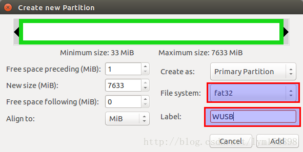

## 格式化U盘

1. 安装gparted

```bash
sudo apt-get install gparted
sudo gparted
```

2. 右上角, 设备栏选择U盘


3. (可能需要卸载U盘, 实际操作的时候我没有这样做  直接就能创建分区表)


4. 创建分区表

选择菜单栏里的Device, 并选择Create Patition Table(分区表)


然后选择msdos项, 并点击Apply


接着，右击未分配空间并选择New。


然后，在File System栏选择fat32或ntfs，并在Label栏填写U盘驱动器的标签号（标签名应该与系统中的其他硬盘相区别，尽量使用大写英文）（标签名应该与系统中的其他硬盘相区别，尽量使用大写英文），并记住之后会使用到。



最后，在菜单栏Edit中选择Apply All Operation项提交所有操作。


5. 给分区添加boot标示

首先右击未分配空间并选择Manager Flags，然后选择boot。


至此，U盘格式化全部完成。

### 如果分区时报错

```bash
Error: Partition(s) 1, 2, 3, 4 on /dev/hdiskA have been written, but we have been unable to 
inform the kernel of the change, probably because it/they are in use.  As a result, the old 
partition(s) will remain in use.  You should reboot now before making further changes
翻译为：错误：已经写入/dev/hdiskA上的分区1、2、3、4，但是我们无法将更改通知内核，可能是因为它/它们正在使用。因此，旧的分区将继续使用。在进行进一步更改之前，现在应该重新启动。
```

重启之后就可以了。

应该是某些程序占用了u盘, 所以无法写入.


## 拷贝ISO文件

```bash
sudo mount xxx.iso  /mnt   把iso文件内容挂载到/mnt文件夹上(文件夹必须先存在)
sudo cp -r /mnt/* u盘的路径
```

## 安装boot引导器

### EFI模式

查看efi/boot文件夹下是否有 bootx64.efi 或者 bootia32.efi   如果有, 则全部工作做完了.

MBR模式参考Make a bootable Windows USB from Linux

备注:

EFI是比MBR更新更高级的模式, 判断机器是否可以用EFI启动, 进入BIOS: boot模式如果有UEFI字样即可


## 参考资料

> - [Ubuntu下制作windows U盘启动盘](https://blog.csdn.net/lym152898/article/details/72858617)
> - [linux下 解压iso文件的方法](https://zhidao.baidu.com/question/535268336.html)
> - [Make a bootable Windows USB from Linux](https://www.onetransistor.eu/2014/09/make-bootable-windows-usb-from-ubuntu.html)
> - [Parted分区问题](https://blog.csdn.net/weixin_38697824/article/details/85328720)
