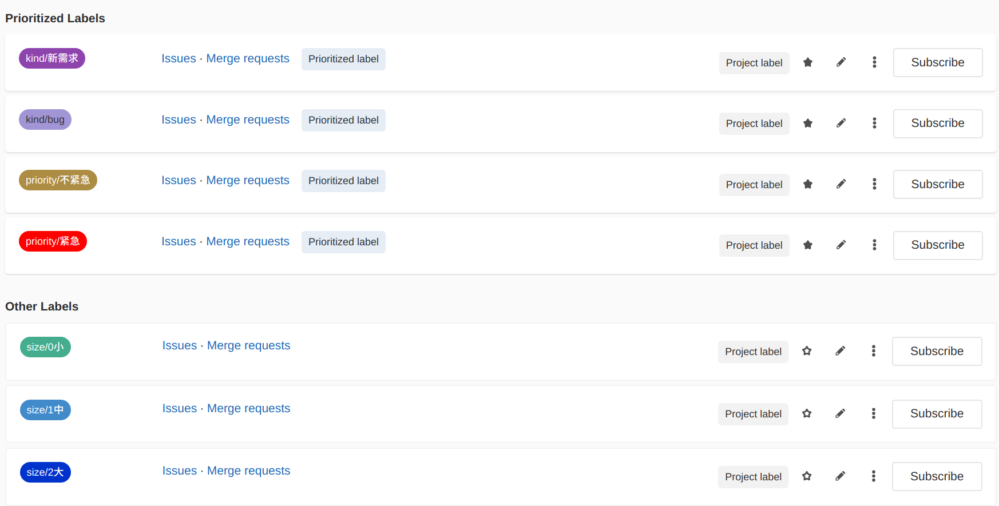
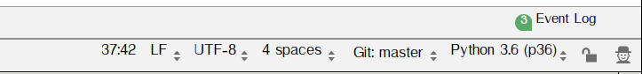
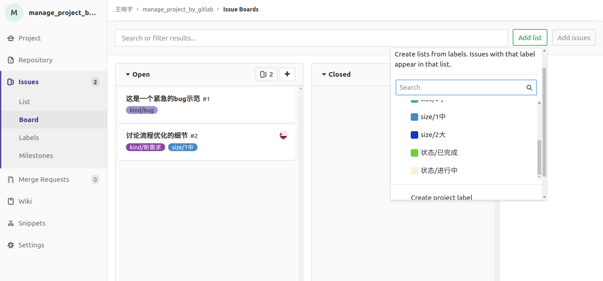

# gitlab使用

### 设置保护分支(master分支不能推送)

> 默认的master分支是收保护的，不能直接push

进入setting--->Repository--->Protected Branches   设置保护分支


### 设置issue模板

在项目repository的代码文件夹新建一个文件夹:   ```.gitlab```

.gitlab/.gitkeep  (空文本)

```bash

```

.gitlab/issue_templates  文件夹

.gitlab/issue_templates/.gitkeep  (空文本)

```bash

```

.gitlab/issue_templates/bug.md

```md
#### 系统信息（代码版本等）


#### 重现步骤


#### 期望结果


#### 报错信息


```

.gitlab/issue_templates/feature.md

```md
#### 要解决什么问题


#### 要实现什么样的功能


#### 用户的应用场景是什么样的


#### 注意事项（用户可能有哪些骚操作，等等）


#### 对现有功能有什么影响


#### 依赖什么模块


```


### labels配置



kind（类型）

- kind/bug
- kind/新需求

priority（优先级）

- priority/紧急
- priority/不紧急

size（工作量）：表示 issue 需要大约花费多少时间/精力，可以用来做简单的工作量评估参考。 

- size/0小
- size/1中
- size/2大


### CRLF/LF/CR

#### 三种换行模式：

| 模式 | 操作系统 | 缩写 |
| ---- | -------- | ---- |
| CRLF | windows  | \n\r |
| CR   | mac OSX  | \r   |
| LR   | Linux    | \n   |

#### pycharm可以在状态栏显示换行符使用的模式，如下图：



点击  LF 可以切换文件的换行模式

#### git--AutoCRLF

```bash
#提交时转换为LF，检出时转换为CRLF
git config --global core.autocrlf true   #windows推荐方式

#提交时转换为LF，检出时不转换
git config --global core.autocrlf input   

#提交检出均不转换
git config --global core.autocrlf false   #Linux/Mac推荐方式
```

#### SafeCRLF

```bash
#拒绝提交包含混合换行符的文件
git config --global core.safecrlf true    #推荐方式

#允许提交包含混合换行符的文件
git config --global core.safecrlf false   

#提交包含混合换行符的文件时给出警告
git config --global core.safecrlf warn
```


# git命令行

### 标签

```bash
标签分为带附注和不带附注的。我们尽量使用带附注的。

# 本地新建一个tag 名称=V1.2
git tag -a V1.2 -m 'xxxxx'

# 查看本地tag
git tag

# 查看tag详细信息
git tag show V1.2

# 推送到远程仓库
git push origin --tags

# 如果发现有问题，可以删除标签（本地）
git tag -d V1.2
# 推送空的同名版本到远程仓库，等同于删除远程库里的版本
git push origin :refs/tags/V1.2

# 获取远程版本，精确拉取某一个版本的代码
git fetch origin tag V1.2
```


### 在board中添加分栏

Issues-->Board-->Add list -->选择要监控的labels



### 本地分支和远程分支

```bash
# 查看当前跟踪关系
git branch -vv

# 克隆时自动将创建好的`master`分支追踪`origin/master`分支
git clone 服务器地址

# 建立本地分支 xxx, 追踪远程分支origin/yyy
git checkout -b xxx origin/yyy

# 将 xxx 分支追踪远程分支 origin/yyy
git branch --set-upstream xxx origin/yyy

# 设置当前分支跟踪远程分支 origin/yyyy
git branch -u origin/yyyy
```


### 设置git默认使用的编辑器

```bash
提交是出现nano界面，可以退出后设置默认编辑器成VIM
git config --global core.editor "vim"
```

### 配置远程仓库的密钥

1. 创建自己的私钥和公钥对
   ``` ssh-keygen -C “备注信息”  -f ~/.ssh/私钥名称 ```       【密码输入空】
2. 设置私钥对应的网站,在~/.ssh/config 文件中写入：

```
  Host deeplycurious.ai 多个远程仓库地址用空格分隔
  IdentityFile ~/.ssh/私钥名称
```

3. 上传公钥
4. 在phabricator里个人--setting--SSH Public Keys-- SSH Key Actions -- Upload Public Key
5. Name 随便取， Public Key 是你的公钥的文本内容

### 强制修改分支位置

```bash
可以直接使用 -f 选项让分支指向另一个提交
# 例如下面。将 master 分支强制指向 HEAD 的第 3 级父提交。（代码恢复到老版本）
git branch -f master HEAD~3
```

### 删除git子模组/子模块

```bash
菜鸟流程:
1. 把子模组文件夹剪切到项目外
2. add/commit/push(删除对应文件夹)
3. 然后把文件夹剪切回来
4. add/commit/push(增加对应文件夹)

官方流程:
# 删除子模块目录及源码
rm -rf 子模块目录 
# 删除项目目录下.gitmodules文件中子模块相关条目
vi .gitmodules 
# 删除配置项中子模块相关条目
vi .git/config 
# 删除模块下的子模块目录，每个子模块对应一个目录，注意只删除对应的子模块目录即可
rm .git/module/* 

# 如果仍然报错，执行如下：
git rm --cached 子模块名称
```


### TODO: 学习  git hooks自动更新

### 提交空文件夹

- 空的.gitignore文件可以作为占位符，使git只创建一个文件夹，里面是空的（一个空.ignore文件）


### 删除文件的git控制

- 如果已经加到版本控制中（push或add过）：用该命令去除控制（**不删除本地文件**）

  - > git  rm  -r  --cached   文件路径

- 如果刚删除caehed，或未add或push过：直接设置  .gitignore 忽略即可。

- .git/info/**exclude** 该文件和.ignore格式相同，但是不会被提交，不会影响他人的忽略名单。


### 忽略已加入控制的文件改动

- git update-index --assume-unchanged 文件名

### 用户名和密码

```bash
# 设置用户名和密码(--global全局配置,否则为本地配置)
git config --global user.email "you@example.com"
git config --global user.name "Your Name"

# 查看用户名和密码
设置命令,不写最后的文本值,即为查看
```

### 给本地代码添加远程git仓库

```bash
# 添加远程仓库 origin是git默认仓库名称
git remote add origin 远程仓库地址

# 重设远程仓库
git remote set-url origin URL

# 查看远程仓库的地址
    git remote -v

# 第一次推送到远程仓库（并把默认远程仓库设置为origin）
git push -u origin master
```

### 修改commit注释

```bash
# 如果commit内容还未push:
git commit --amend
```


[可视化交互git学习，知识点如下](https://learngitbranching.js.org/?demo)

### 创建和切换分支

```bash
# 创建分支（当前分支不变）
git branch newxxx
# 切换当前分支到xxx
git checkout xxx

# 创建并切换到newxxx分支
git checkout -b newxxx
```


### rebase

```bash
# 当前在bugFix分支，命令会把bugFix节点的父节点指向master
# C1-->C2（master）    命令结果：C1-->C2(master)-->C3‘(bugFix*)
#   -->C3（bugFix*）              -->C3
git rebase master

# 当前C2(master)-->C3‘(bugFix*) 则指向同一个
git rebase bugFix
```

HEAD

```bash
HEAD 是指git当前正在操作的节点指针
HEAD 可以指向某个分支名，也可以指向某个节点名

# 查看当前HEAD 
cat .git/HEAD
# 查看HEAD指向的引用
git symbolic-ref HEAD

# 查看提交树的节点的哈希值
git log
# 切换HEAD指针（绝对值切换）
git checkout 节点-哈希值/分支名
# 切换HEAD指针（相对切换）
    # 使用 ^ 向上移动 1 个提交记录
	git checkout master^
	git checkout HEAD^
	# 使用 ~<num> 向上移动多个提交记录，（不加数字则向上1个）
	git checkout master~3


```

### 修改分支位置

```bash
# -f 选项让分支指向另一个提交
# 下面命令将 master 分支强制指向 HEAD 的第 3 级父提交。
git branch -f master HEAD~3


```

### 恢复到merge之前

```bash
# ORIG_HEAD 是git在做危险操作时候给HEAD做的备份
git reset --hard ORIG_HEAD
# ORIG_HEAD 等价于 HEAD@{1}  
```


## 参考资料

> - []()
> - []()
