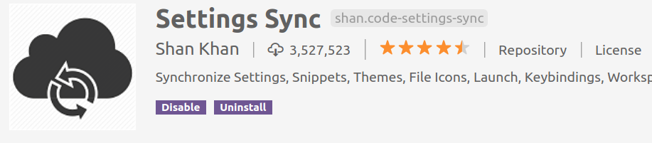
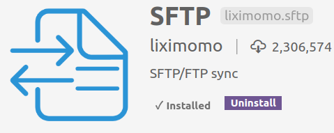

## 使用正则表达式替换

搜索文本：static/(.*).css

替换文本中用  $1来表示括号里匹配的内容


## 安装插件

### Setting Sync 

在不同电脑同步你的配置和插件。上传配置：

1. 安装插件
2. 用默认浏览器登录github网站
3. shift+alt+U  上传配置：vscode会打开github网站的tokens页面
4. 在网页选择 Generate new token
5. 输入token key
6. 勾选gist
7. 点击Generate token  创建token
8. 复制网页返回的token文本
9. 在vscode的命令可输入token文本，回车
10. 上传成功

下载备份：

1. 在另一个电脑的vscode安装插件
2. shift+alt+D  下载配置：vscode会打开github网站的tokens页面
3. 先输入token key
4. 再输入token id 回车即可

如果在下载备份过程中出错，需要执行 Sync:Reset Extension Settings 重置选项才可以再次执行 shift+alt+d

### SFTP

查看远程代码

1. ctrl+shift+P  输入 SFTP: config
2. 如果提示要打开文件夹，则在某个位置打开一个存储SFTP配置的文件夹
3. 然后进行配置json，示范如下：

```json
{
    "name": "远程项目名称",
    "host": "192.168.1.10",
    "protocol": "sftp", 
    "syncMode": "update",
    "username": "demo",
    "remotePath": "/home/demo/demo1",
    "privateKeyPath": "/home/user/.ssh/id_rsa",
    "uploadOnSave": true
}

```


### Path Intellisense

自动提示文件路径，支持各种快速引入文件。


### Paste Json As Code

把粘贴内容格式化。打开命令板，输入Paste Json As Code的命令即可

### Gitlens

查看代码的最后一行git日志。点击右上角图标即可对比展示你的代码与原repo的区别


## 参考资料
> - []()
> - []()
