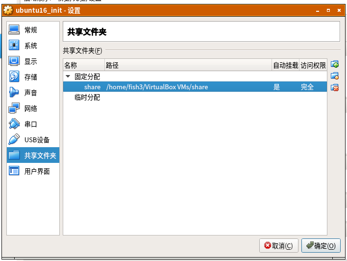
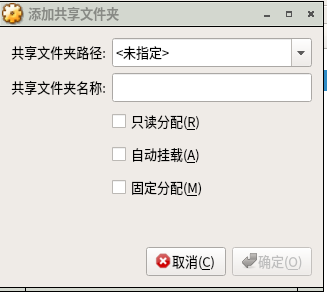

## 安装虚拟机VirtualBox

```bash
# 首先添加VirtualBox的源
sudo sh -c 'echo "deb http://download.virtualbox.org/virtualbox/debian xenial contrib" >> /etc/apt/sources.list.d/virtualbox.list'

# 添加秘钥
wget -q https://www.virtualbox.org/download/oracle_vbox_2016.asc -O- | sudo apt-key add -

# 执行更新
sudo apt update

# 安装virtualbox
sudo apt install virtualbox

# 下载增强插件（注意插件版本要和虚拟机程序版本一致）
https://www.virtualbox.org/wiki/Downloads
VirtualBox 6.0.6 Oracle VM VirtualBox Extension Pack
 All supported platforms
 # 老版本下载：Extension Pack
 https://www.virtualbox.org/wiki/Download_Old_Builds_5_2
 
 # 安装宿主机上的插件
 管理--全局设定--扩展--加号---选择下载插件-安装
```

## 使用方法简介

1. 设置一个虚拟机
2. 载入一个系统iso，安装系统
3. 把系统导出，方便以后导入使用


## ubtuntu虚拟机--设置共享文件夹

**宿主机上操作**

选中虚拟机项目，右键---设置---共享文件夹---点击最右侧的**加号**按钮





在共享文件夹路径里设置宿主机里的某个路径，再设置一个共享文件夹名称

**虚拟机内操作**

安装增强插件

创建虚拟机内路径，然后挂载到该路径

```bash
# 创建路径
mkdir /home/user/data

# 挂载
# 其中“share”就是共享文件夹的名称
sudo mount -t vboxsf share /home/user/data
```


## 参考资料

> - []()
> - []()
