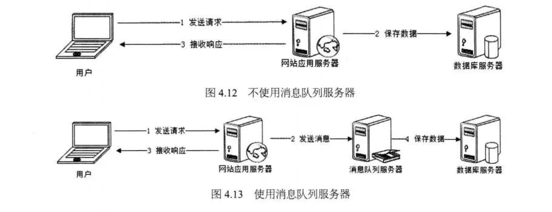
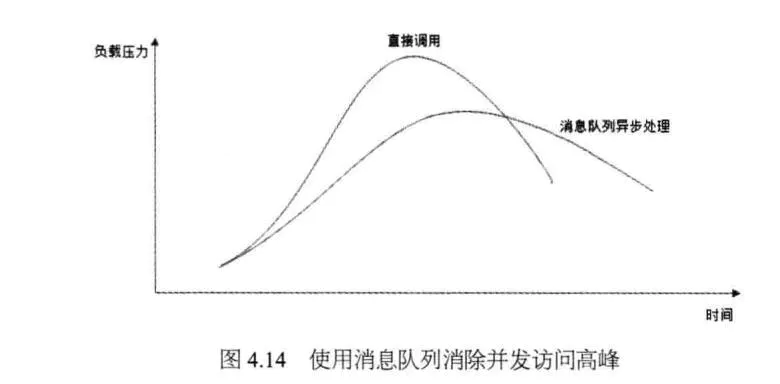
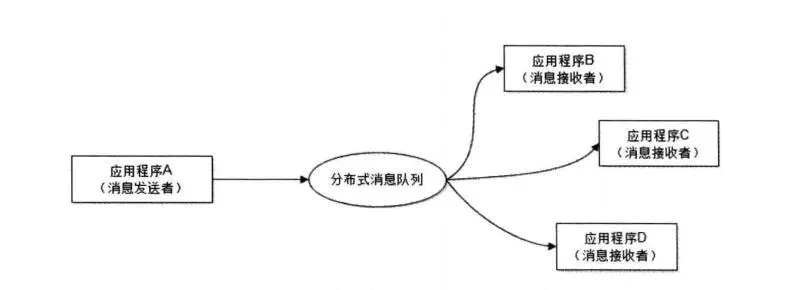

.

## 1. 消息队列的定义

消息队列是一个存放消息的容器，一般用于生产者消费者的设计模式，作为一种消息中间剑。

消息队列里存储的数据和数据库的区别是数据库可以查询关系，而消息队列只有当前消息可被查询。

## 2. 消息队列的优势

###  1. 通过异步处理提高系统性能（削峰、减少响应所需时间）

由于消息队列比数据库存储更快，所以可以提高异步系统的性能。

当然由于消息队列的后续处理状态不确定（可能失败），所以在流程上需要增加一个步骤，告诉用户现在是在消息队列里等待后续处理的状态。（例如购买车票后，真正出票会再次提醒）

### 2. 降低系统耦合性

生产者和消费者不直接产生耦合。便于系统扩展。

## 3. 消息队列的缺点

- 系统可用性降低
  - 在加入MQ之前，你不用考虑消息丢失或者说MQ挂掉等等的情况，但是，引入MQ之后你就需要去考虑了！
-  系统复杂性提高
  - 加入MQ之后，你需要保证消息没有被重复消费、处理消息丢失的情况、保证消息传递的顺序性等等问题！
-  一致性问题
  - 消息队列可以实现异步，消息队列带来的异步确实可以提高系统响应速度。但是，万一消息的真正消费者并没有正确消费消息怎么办？这样就会导致数据不一致的情况了!

### 4. 消息通信模式

#### 4.1 点对点模式

点对点模式通常是基于拉取或者轮询的消息传送模型，这个模型的特点是发送到队列的消息被一个且只有一个消费者进行处理。生产者将消息放入消息队列后，由消费者主动的去拉取消息进行消费。点对点模型的的优点是消费者拉取消息的频率可以由自己控制。但是消息队列是否有消息需要消费，在消费者端无法感知，所以在消费者端需要额外的线程去监控。

#### 4.2 发布订阅模式

发布订阅模式是一个基于消息送的消息传送模型，改模型可以有多种不同的订阅者。生产者将消息放入消息队列后，队列会将消息推送给订阅过该类消息的消费者（类似微信公众号）。由于是消费者被动接收推送，所以无需感知消息队列是否有待消费的消息！但是consumer1、consumer2、consumer3由于机器性能不一样，所以处理消息的能力也会不一样，但消息队列却无法感知消费者消费的速度！所以推送的速度成了发布订阅模模式的一个问题！假设三个消费者处理速度分别是8M/s、5M/s、2M/s，如果队列推送的速度为5M/s，则consumer3无法承受！如果队列推送的速度为2M/s，则consumer1、consumer2会出现资源的极大浪费！

### 4. 软件对比

- RabbitMQ 在吞吐量方面虽然稍逊于 Kafka 和 RocketMQ ，但是由于它基于 erlang 开发，所以并发能力很强，性能极其好，延时很低，达到微秒级。但是也因为 RabbitMQ 基于 erlang 开发，所以国内很少有公司有实力做erlang源码级别的研究和定制。如果业务场景对并发量要求不是太高（十万级、百万级），那这四种消息队列中，RabbitMQ 一定是你的首选。如果是大数据领域的实时计算、日志采集等场景，用 Kafka 是业内标准的，绝对没问题，社区活跃度很高，绝对不会黄，何况几乎是全世界这个领域的事实性规范。
- ActiveMQ 和 RabbitMQ 丢失的可能性非常低， RocketMQ 和 Kafka 理论上不会丢失。
- kafka 的特点其实很明显，就是仅仅提供较少的核心功能，但是提供超高的吞吐量，ms 级的延迟，极高的可用性以及可靠性，而且分布式可以任意扩展。同时 kafka 最好是支撑较少的 topic 数量即可，保证其超高吞吐量。kafka 唯一的一点劣势是有可能消息重复消费，那么对数据准确性会造成极其轻微的影响，在大数据领域中以及日志采集中，这点轻微影响可以忽略这个特性天然适合大数据实时计算以及日志收集。
  

## 参考资料
> - 
> - 
