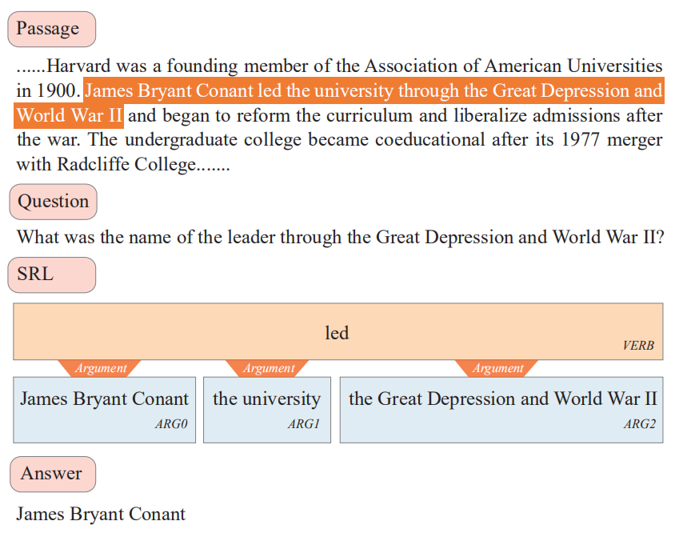
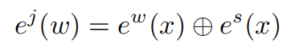
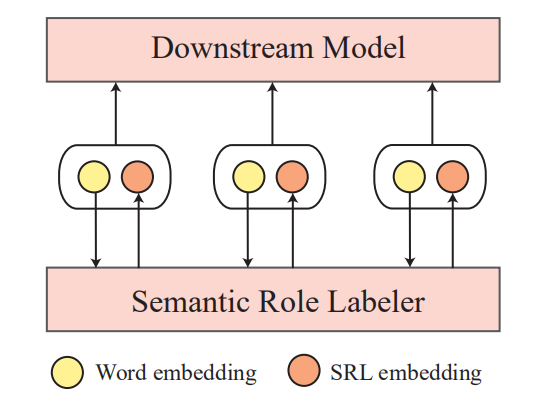
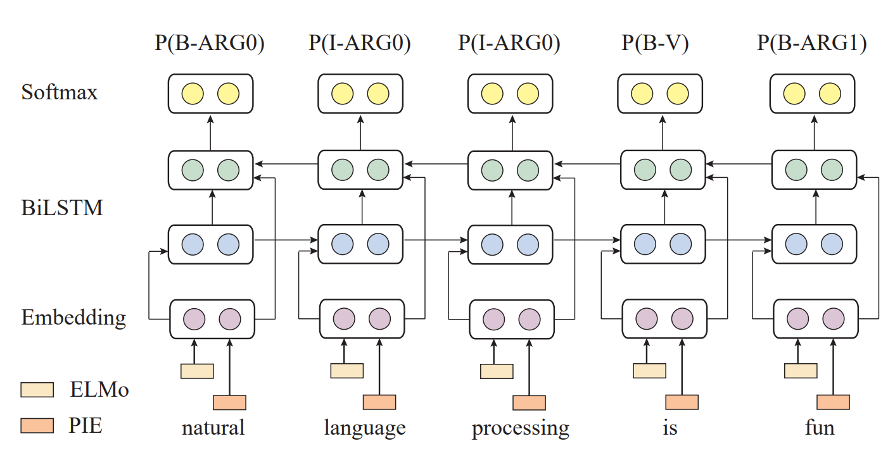

# I Know What You Want: Semantic Learning for Text Comprehension

> ABSTRACT  摘要 
>
> Who did what to whom is a major focus in natural language understanding, which is right the aim of semantic role labeling (SRL). Although SRL is naturally essential to text comprehension tasks, it is surprisingly ignored in previous work. This paper thus makes the first attempt to let SRL enhance text comprehension and inference through specifying verbal arguments and their corresponding semantic roles. In terms of deep learning models, our embeddings are enhanced by semantic role labels for  more fine-grained semantics. We show that the salient labels can be conveniently added to existing models and significantly improve deep learning models in challenging text comprehension tasks. Extensive experiments  on benchmark machine reading comprehension and inference datasets verify that the proposed semantic learning helps our system reach new state-of-the-art.
>
> 谁对谁做了什么是自然语言理解的主要重点，这正是语义角色标记（SRL）的目标。 尽管SRL自然是文本理解任务所必需的，但是在以前的工作中却意外地忽略了它。 因此，本文首次尝试通过指定语言参数及其相应的语义角色来使SRL增强文本的理解和推断能力。 在深度学习模型方面，我们的嵌入通过语义角色标签得到了增强，以实现更细粒度的语义。 我们证明了可以将显着标签方便地添加到现有模型中，并在挑战性的文本理解任务中显着改善深度学习模型。 在基准机器阅读理解和推理数据集上进行的大量实验证明，所提出的语义学习有助于我们的系统达到最新的水平。

### Introduction

Text comprehension (TC) is challenging for it requires computers to read and understand natural language texts to answer questions or make inference, which is indispensable for advanced context-oriented dialogue and interactive systems. This paper focuses on two core text comprehension tasks, machine reading comprehension (MRC) and textual entailment (TE).

文本理解（TC）具有挑战性，因为它要求计算机阅读和理解自然语言文本以回答问题或进行推理，这对于高级的面向上下文的对话和交互式系统是必不可少的。 本文着重于两个核心的文本理解任务，机器阅读理解（MRC）和文本蕴涵（TE）。

One of the intrinsic challenges for TC is the semantic learning. Though deep learning has been applied to a variety of natural language processing (NLP) tasks with remarkable performance (Zhang et al. 2018; Zhu et al. 2018; Zhang and Zhao 2018), recent studies have found deep learning models might not really understand the natural language texts (Mudrakarta et al. 2018) and vulnerably suffer from adversarial attacks (Jia and Liang 2017). Typically, an MRC model pays great attention to non-significant words and ignores important terms and actions. For example, most of the highly  attributed words such as there, be, how are usually less important in questions. To help model better understand natural language, **we are motivated to discover an effective way to distill the semantics inside the input sentence explicitly, such as semantic role labeling, instead of completely relying on uncontrollable model parameter learning or manual pruning techniques.** 

TC的内在挑战之一是语义学习。 尽管深度学习已应用于表现出色的各种自然语言处理（NLP）任务（Zhang et al.2018; Zhu et al.2018; Zhang and Zhao 2018），但最近的研究发现深度学习模型可能无法真正理解 自然语言文本（Mudrakarta等人，2018）并且极易遭受对抗性攻击（Jia和Liang，2017）。 通常，MRC模型非常注意非有效词，而忽略重要的术语和动作。 例如，大多数高属性词（例如，在那儿）在问题中通常不那么重要。 为了帮助模型更好地理解自然语言，**我们希望找到一种有效的方法来明确提取输入句子中的语义，例如语义角色标签，而不是完全依赖不可控制的模型参数学习或手动修剪技术。**

Semantic role labeling (SRL) is a shallow semantic parsing task aiming to discover who did what to whom, when and why, which naturally matches the task target of text comprehension. For MRC, questions are usually formed with who, what, how, when and why, whose predicate-argument relationship that is supposed to be from SRL is of the same importance as well. Besides, SRL has been proved to be beneficial to a wide range of NLP tasks, including discourse relation sense classification (Mihaylov and Frank 2016), machine translation (Shi et al. 2016) and question answering (Yih et al. 2016). All the previous successful work indicates that SRL may be hopefully integrated into reading comprehension and inference tasks.

语义角色标记（SRL）是一项浅层的语义分析任务，旨在发现谁对谁，何时何地做了什么，这自然符合文本理解的任务目标。 对于MRC，通常由谁，什么，如何，何时以及为什么以及应该来自SRL的谓词-自变量关系同样重要地形成问题。 此外，已证明SRL对许多NLP任务均有益，包括话语关系意义分类（Mihaylov和Frank 2016），机器翻译（Shi等人2016）和问题解答（Yih等人2016）。 所有先前的成功工作表明，SRL有望集成到阅读理解和推理任务中。

Some work studied question answering (QA) driven SRL, like QA-SRL parsing (He, Lewis, and Zettlemoyer 2015; Fitzgerald, He, and Zettlemoyer 2018). They focus on detecting argument spans for a predicate and generating questions to annotate the semantic relationship. However, our task is quite different. In QA-SRL, the focus is commonly simple and short factoid questions that are less related to the context, let alone makes inference. Actually, text comprehension and inference are quite challenging tasks in NLP, requiring to dig the deep semantics between the document and comprehensive question which are usually raised or rewritten by humans, instead of shallow argument alignment around the same predicate in QA-SRL. In this work, to alleviate such an obvious shortcoming about semantics, we make the first attempt to explore integrative models for finergrained text comprehension and inference. In this work, we propose an SRL-based enhancement framework for TC  tasks, which boosts the strong baselines effectively. We implement an easy and feasible scheme to integrate SRL signals in downstream neural models in end-to-end manner. An example about how SRL helps MRC is illustrated in Figure 1. A series of detailed case studies are employed to analyze the robustness of the semantic role labeler. To our best knowledge, our work is the first attempt to apply SRL for text comprehension tasks, which have been ignored in previous works for a long time.

一些工作研究了由问答（QA）驱动的SRL，例如QA-SRL解析（He，Lewis，and Zettlemoyer 2015; Fitzgerald，He，and Zettlemoyer 2018）。他们专注于检测谓词的论元跨度并生成问题以注释语义关系。但是，我们的任务完全不同。在QA-SRL中，重点通常是简单的，简短的事实性问题，与上下文关系较少，更不用说进行推理了。实际上，文本理解和推理在NLP中是一项极富挑战性的任务，需要挖掘文档和通常由人提出或重写的综合性问题之间的深层语义，而不是围绕QA-SRL中相同谓词的浅层参数对齐。在这项工作中，为了缓解语义上的明显缺陷，我们首次尝试探索用于更细粒度的文本理解和推断的集成模型。在这项工作中，我们为TC任务提出了一个基于SRL的增强框架，该框架有效地提高了坚固的基准。我们实现了一种简单可行的方案，以端到端的方式将SRL信号集成到下游神经模型中。图1给出了有关SRL如何帮助MRC的示例。采用了一系列详细的案例研究来分析语义角色标记器的鲁棒性。据我们所知，我们的工作是将SRL应用于文本理解任务的首次尝试，而在以前的工作中长期以来一直忽略该任务。

The rest of this paper is organized as follows. The next section reviews the related work. Section 3 will demonstrate our semantic learning framework and implementation. Task details and experimental results are reported in Section 4, followed by case studies and analysis in Section 5 and conclusion in Section 6.

本文的其余部分安排如下。 下一节将回顾相关工作。 第三部分将演示我们的语义学习框架和实现。 任务详细信息和实验结果在第4节中进行了报告，随后在第5节中进行了案例研究和分析，在第6节中进行了总结。

Figure 1: Semantic role labeling guides text comprehension. 图1：语义角色标签指导文本理解。

## Related Work

### Text Comprehension

### Semantic Role Labeling

## Semantic Role Labeling for Text Comprehension

For either of text comprehension tasks, we consider an end-to-end model as well as the semantic learning model. The former may be regarded as downstream model of the latter. Thus, our SRL augmented model will be an integration of two end-to-end models through simple embedding concatenation as shown in Figure 2.

对于任何一种文本理解任务，我们都考虑了端到端模型以及语义学习模型。 前者可被视为后者的下游模型。因此，我们的SRL增强模型将通过简单的嵌入串联将两个端到端模型集成在一起，如图2所示。

We apply semantic role labeler to annotate the semantic tags (i.e. predicate, argument) for each token in the input sequence, and then the input sequence along with the corresponding SRL labels is fed to downstream models. We regard the SRL signals as SRL embeddings and employ a lookup table to map each label to vectors, similar to the implementation of word embedding. For each word x, a joint embedding e^j(w) is obtained by the concatenation of word embedding e^w(x) and SRL embedding e^s(x), where ⊕ is the concatenation operator. The downstream model is task-specific. In this work, we focus on the textual entailment and machine reading comprehension, which will be discussed latter.

我们应用语义角色标记器为输入序列中的每个标记注释语义标记（即谓词，自变量），然后将输入序列与相应的SRL标签一起馈入下游模型。 我们将SRL信号视为SRL嵌入，并使用查找表将每个标签映射到向量，类似于单词嵌入的实现。 对于每个单词x，通过单词嵌入e ^ w（x）和SRL嵌入e ^ s（x）的级联获得联合嵌入e ^ j（w），其中⊕是级联运算符。 下游模型是特定于任务的。 在这项工作中，我们专注于文本含义和机器阅读理解，这将在后面讨论。

Figure 2: Overview of the semantic learning framework.

### Semantic Role Labeler

Our concerned SRL includes two subtasks: predicate identification and argument labeling. While the CoNLL-2005 shared task assumes gold predicates as input, this information is not available in many applications, which requires us to identify the predicates for a input sentence at the very beginning. Thus, our SRL module has to be end-to-end, predicting all predicates and corresponding arguments in one shot.

我们关注的SRL包括两个子任务：谓词识别和参数标注。 虽然CoNLL-2005共享任务假定使用黄金谓词作为输入，但是在许多应用程序中此信息不可用，这要求我们从一开始就确定输入句子的谓词。 因此，我们的SRL模块必须是端到端的，一次就能预测所有谓词和相应的参数。

We use spaCy①  to tokenize the input sentence with part-of-speech (POS) tags and the verbs are marked as the binary predicate indicator for whether the word is the verb for the sentence.

我们使用spaCy①通过词性（POS）标记对输入句子进行标记化，并将动词标记为该词是否为该句子的动词的二元谓词指示符。

①https://spacy.io/

Following (He et al. 2017), we model SRL as a span tagging problem using BIO encoding ② and use an 8-layer deep BiLSTM with forward and backward directions interleaved. Different from the baseline model, we replace the GloVe embeddings with ELMo representations③ due to the recent success of ELMo in NLP tasks (Peters et al. 2018).

随后（He et al.2017），我们将SRL建模为使用BIO编码② 的跨度标记问题，并使用8层深度BiLSTM，其中前后方向交错。 与基线模型不同，由于ELMo在NLP任务中的最新成功，我们用ELMo③表示法替换了GloVe嵌入（Peters et al.2018）。

②To represent a token at the beginning, interior, or outside of any span, respectively.

③3The ELMo representation is obtained from https://allennlp.org/elmo. We use the original one for this work whose output size is 512.

In brief, the implementation of our SRL is a series of stacked interleaved LSTMs with highway connections (Srivastava, Greff, and Schmidhuber 2015). The inputs are embedded sequences of words concatenated with a binary indicator containing whether a word is the verbal predicate. Additionally, during inference, Viterbi decoding is applied to accommodate valid BIO sequences. The details are  as follows.

简而言之，我们SRL的实现是一系列具有highway连接的堆叠式交错LSTM（Srivastava，Greff和Schmidhuber 2015）。 输入是单词的嵌入序列，该序列与二进制指示符连接在一起，该二进制指示符包含单词是否为谓语。 另外，在推论期间，维特比解码被应用以适应有效的BIO序列。 详情如下所示。

Figure 3: Semantic role labeler.

#### Word Representation 

The word representation of our SRL model is the concatenation of two vectors: an ELMo embedding e^(l) and predicate indicator embedding (PIE) e^(p) . ELMo is trained from the internal states of a deep bidirectional language model (BiLM), which is pre-trained on a large text corpus with approximately 30 million sentences (Chelba et al. 2014). Besides, following (He et al. 2018b) who shows the predicate-specific feature is helpful in promoting the role labeling, we employ a predicate indicator embedding e^(p) to mark whether a word is a predicate when predicting and labeling the argum ents. The final word representation is given by e = e^(l) ⊕ e^(p) , where ⊕ is the concatenation operator.

我们的SRL模型的词表示形式是两个向量的串联：ELMo嵌入e ^(l) 和谓词指示符嵌入（PIE）e ^（p）。 ELMo是从深度双向语言模型（BiLM）的内部状态进行训练的，该模型在具有大约3000万个句子的大型文本语料库上进行了预训练（Chelba等，2014）。 此外，以下（He et al.2018b）展示了谓词特定的功能有助于促进角色标注，我们在预测和标注argum时采用了谓词指示符嵌入e ^（p）来标记单词是否为谓词。 ents。 最终的单词表示形式由e = e ^（l）⊕e ^（p）给出，其中⊕是连接运算符。

#### Encoder

As commonly used to model the sequential input, BiLSTM is adopted for our sentence encoder. By incorporating a stack of distinct LSTMs, BiLSTM processes an input sequence in both forward and backward directions. In this way, the BiLSTM encoder provides the ability to incorporate the contextual information for each word.

Given a sequence of word representation S = {e1, e2, · · · , eN } as input, the i-th hidden state hi is encoded as follows:

作为对顺序输入进行建模的常用方法，我们的句子编码器采用了BiLSTM。 通过合并不同LSTM的堆栈，BiLSTM在向前和向后两个方向上处理输入序列。 这样，BiLSTM编码器就可以为每个单词合并上下文信息。

给定一系列单词表示形式S = {e1，e2，···，eN}作为输入，第i个隐藏状态hi编码如下：

where LSTM^F denotes the forward LSTM transformation and LSTMB denotes the backward LSTM transformation. h
f
i
and h
b
i
are the hidden state vectors of the forward LSTM and backward LSTM respectively.

This LSTM uses highway connections between layers and variational recurrent dropout. The encoded representation is then projected using a final dense layer followed by a softmax activation to form a distribution over all possible tags. The predicted SRL Labels are defined in PropBank (Palmer, Gildea, and Kingsbury 2005) augmented with B-I-O tag set to represent argument spans.

该LSTM使用图层之间的highway连接和可变递归dropout。 然后，使用最终的密集层投影编码的表示，然后进行softmax激活以在所有可能的标签上形成分布。 预测的SRL标签在PropBank中定义（Palmer，Gildea和Kingsbury 2005），并增加了B-I-O标签集以表示参数范围。

### Model Implementation

The training objective is to maximize the logarithm of the likelihood of the tag sequence, and we expect the correct output sequence matches with, where C is candidate label set.

训练目标是最大化标签序列可能性的对数，并且我们期望与之匹配的正确输出序列，其中C是候选标签集。

Our semantic role labeler is trained on English OntoNotes v5.0 benchmark dataset (Pradhan et al. 2013) for the CoNLL-2012 shared task, achieving an F1 of 84.6%4 on the  test set. At test time, we perform Viterbi decoding to enforce valid spans using BIO constraints5 . For the following evaluation, the default dimension of SRL embeddings is 5 and the case study concerning the dimension is shown in the subsection dimension of SRL Embedding.

我们的语义角色标签在CoNLL-2012共享任务的英语OntoNotes v5.0基准数据集（Pradhan等人，2013）上进行了培训，在测试集上的F1达到84.6％4。 在测试时，我们执行Viterbi解码，以使用BIO约束5强制有效跨度。 为了进行以下评估，SRL嵌入的默认尺寸为5，有关该尺寸的案例研究显示在SRL嵌入的小节尺寸中。

The model is run forward for every verb in the sentence. In some cases there is more than one predicate in a sentence, resulting in various semantic role sets whose number is equal to the number of predicates. For convenient downstream model input, we need to ensure the word and the corresponding label are matched one-by-one, that is, only one set for a sentence. To this end, we select the corresponding BIO sets with the most non-O labels as the semantic role labels. For sentences with no predicate, we directly assign O labels to each word in those sentences.

该模型针对句子中的每个动词都向前运行。 在某些情况下，一个句子中有多个谓词，导致各种语义角色集的数量等于谓词的数量。 为了方便下游模型输入，我们需要确保单词和对应的标签是一对一匹配的，也就是说，一个句子只有一组。 为此，我们选择具有最多非O标签的相应BIO集作为语义角色标签。 对于没有谓词的句子，我们直接为这些句子中的每个单词分配O标签。

### Text Comprehension Model

#### Textual Entailment

Our basic TE model is the reproduced Enhanced Sequential Inference Model (ESIM) (Chen et al. 2017) which is a widely used baseline model for textual entailment. ESIM employs a BiLSTM to encode the premise and hypothesis, followed by an attention layer, a local inference layer, an inference composition layer. Slightly different from (Chen et al. 2017), we do not include extra syntactic parsing features and directly replace the pre-trained Glove word embedding with ELMo which are completely character based. Our SRL embedding is concatenated with ELMo embeddings and the joint embeddings are then fed to the BiLSTM encoders.

我们的基本TE模型是复制的增强顺序推理模型（ESIM）（Chen等，2017），它是用于文本蕴涵的广泛使用的基线模型。 ESIM使用BiLSTM编码前提和假设，然后是关注层，本地推理层，推理组成层。 与（Chen et al.2017）稍有不同，我们不包含额外的语法解析功能，而是直接使用完全基于字符的ELMo替换预先训练的Glove单词嵌入。 我们的SRL嵌入与ELMo嵌入串联在一起，然后将联合嵌入馈送到BiLSTM编码器。

#### Machine Reading Comprehension

Our baseline MRC model is an enhanced version of Bidirectional Attention Flow (Seo et al. 2017) following (Clark and Gardner 2018). The token embedding is the concatenation of pre-trained Glove word vectors, a character-level embedding from a convolutional neural network with max-pooling and pretrained ELMo embeddings from language models (Peters et al. 2018). Our SRL enhanced model takes input of concatenating the token embedding with SRL embeddings. The embeddings of document and question are passed through a shared bi-directional GRU (BiGRU), followed by a bidirectional attention from (Seo et al. 2017) to obtain the context vectors. The contextual document and question representations are then passed to a residual self-attention layer. Then, the model predicts the start and end token of the answer. To this end, a BiGRU is applied, with a linear layer to compute answer start scores for each word. The hidden states are concatenated with the input and fed into a second bidirectional GRU and linear layer to predict answer end scores. Then, we apply a softmax operation to produce start and end probabilities, and we optimize the negative loglikelihood of selecting correct start and end tokens.

我们的基线MRC模型是（Clark and Gardner 2018）之后的双向注意力流的增强版本（Seo et al.2017）。令牌嵌入是预训练的Glove词向量的串联，这是来自卷积神经网络的字符级嵌入，具有最大池和来自语言模型的预训练ELMo嵌入（Peters等人2018）。我们的SRL增强模型采用了将令牌嵌入与SRL嵌入串联的输入。文档和问题的嵌入通过共享的双向GRU（BiGRU）传递，然后来自（Seo et al.2017）的双向关注以获得上下文向量。然后将上下文文档和问题表示形式传递到剩余的自我注意层。然后，模型预测答案的开始和结束标记。为此，应用BiGRU，它具有一个线性层来计算每个单词的答案开始分数。隐藏状态与输入串联在一起，并馈入第二个双向GRU和线性层以预测答案得分。然后，我们应用softmax运算来产生开始和结束概率，并优化选择正确的开始和结束标记的负对数可能性。

### Evaluation

In this section, we evaluate the performance of SRL embeddings on two kinds of text comprehension tasks, textual entailment and reading comprehension. Both of the concerned tasks are quite challenging, and could be even more difficult considering that the latest performance improvement has been already very marginal. However, we present a new solution instead of heuristically stacking network design techniques. Namely, we show that SRL embeddings could be potential to give further advances due to its meaningful linguistic augments, which has not been studied yet for the concerned tasks.

在本节中，我们评估SRL嵌入在两种文本理解任务上的性能，即文本蕴涵和阅读理解。 考虑到最新的性能改进已经非常微不足道，这两个相关的任务都是非常具有挑战性的，并且甚至可能更加困难。 但是，我们提出了一种新的解决方案，而不是试探性地堆叠网络设计技术。 即，我们表明，由于SRL有意义的语言扩充，SRL嵌入有潜力进一步发展，但尚未针对相关任务进行研究。

Table 3 shows the hyper-parameters of our models. In our experiments, we basically follow the same hyper-parameters for each model as the original settings from their corresponding literatures (He et al. 2018b; Peters et al. 2018; Chen et al. 2017; Clark and Gardner 2018) except those specified (e.g. SRL embedding dimension). For both of the tasks, we also report the results by using pre-trained BERT (Devlin et al. 2018) as word representation in our baseline models 6 . The hyperparameters were selected using the Dev set, and the reported Dev and Test scores are averaged over 5 random seeds using those hyper-parameters.

表3显示了我们模型的超参数。 在我们的实验中，除了指定的参数外，我们基本上遵循每个模型与其相应文献中原始设置相同的超参数（He等人2018b; Peters等人2018; Chen等人2017; Clark和Gardner 2018） （例如，SRL嵌入尺寸）。 对于这两项任务，我们还通过使用预训练的BERT（Devlin等人，2018）作为基线模型中的单词表示来报告结果6。 使用Dev集选择超参数，并使用这些超参数在5个随机种子上平均报告的Dev和Test分数。

### Textual Entailment 文字蕴涵

Textual entailment is the task of determining whether a hypothesis is entailment, contradiction and neutral, given a premise. The Stanford Natural Language Inference (SNLI) corpus (Bowman et al. 2015) provides approximately 570k hypothesis/premise pairs. We evaluate the model performance in terms of accuracy.

文本蕴涵是在给定前提的情况下确定假设是否是蕴涵，矛盾和中立的任务。 斯坦福大学自然语言推理（SNLI）语料库（Bowman等，2015）提供了大约570k假设/前提对。 我们根据准确性评估模型性能。

Results in Table 4 show that SRL embedding can boost the ESIM+ELMo model by +0.7% improvement 7 . With the semantic cues, the simple sequential encoding model yields substantial gains over the previous models, and our single BERTLARGE model also achieves a new state-of-the-art, even outperforms all the ensemble models in the leaderboard. This would be owing to more accurate and fine-grained information from effective explicit semantic cues.

表4中的结果表明，SRL嵌入可以将ESIM + ELMo模型提高+ 0.7％7。 有了语义提示，简单的顺序编码模型比以前的模型有了实质性的收益，我们的单个BERT-LARGE模型也实现了最新的技术水平，甚至超过了排行榜中的所有集成模型。 这将归因于来自有效显式语义线索的更准确和更细粒度的信息。

To evaluate the contributions of key factors in our method, a series of ablation studies are performed on the SNLI dev and test set. The results are in Table 5. We observe both SRL and ELMo embeddings contribute to the overall performance. Note that ELMo is obtained by deep bidirectional language with 4,096 hidden units on a large-scale corpus, which requires a huge amount of training time with 93.6 million parameters. The output dimension of ELMo is 512. Compared with the massive computation and high dimension, the SRL embedding is much more convenient for training and much easier for model integration, giving the same level of performance gains.

为了评估我们方法中关键因素的贡献，对SNLI开发人员和测试集进行了一系列消融研究。 结果在表5中。我们观察到SRL和ELMo嵌入都有助于整体性能。 请注意，ELMo是通过深度双向语言获得的，具有大规模语料库中的4,096个隐藏单元，这需要大量训练时间和9360万个参数。 ELMo的输出维度为512。与海量计算和高维度相比，SRL嵌入更易于训练，更易于模型集成，从而获得了相同水平的性能提升。

### Machine Reading Comprehension

To investigate the effectiveness of the SRL embedding in conjunction with more complex models, we conduct experiments on machine reading comprehension tasks. The reading comprehension task can be described as a triple < D, Q, A >, where D is a document (context), Q is a query over the contents of D, in which a span is the right answer A.

为了研究与更复杂的模型结合使用SRL的有效性，我们对机器阅读理解任务进行了实验。 阅读理解任务可以描述为三元组<D，Q，A>，其中D是文档（上下文），Q是对D内容的查询，其中跨度是正确答案A。

As a widely used benchmark dataset for machine reading comprehension, the Stanford Question Answering Dataset (SQuAD) (Rajpurkar et al. 2016) contains 100k+ crowd sourced question-answer pairs where the answer is a span in a given Wikipedia paragraph. Two metrics are selected to evaluate the model performance: Exact Match (EM) and a softer metric F1 score, which measures the weighted average of the precision and recall rate at a character level.

作为用于机器阅读理解的广泛使用的基准数据集，斯坦福问答数据集（SQuAD）（Rajpurkar等人，2016）包含100k +众包问答题对，其中答案是给定Wikipedia段落中的跨度。 选择了两个度量来评估模型性能：精确匹配（EM）和较软的度量F1分数，该度量在字符级别上测量精度和召回率的加权平均值。

Table 6 shows the results⑧ . The SRL embeddings give an absolute +0.81% and relative +5.48% performance gains, showing it is also quite effective for more complex document and question encoding.

表6示出了结果。 SRL嵌入提供了绝对的+ 0.81％和相对的+ 5.48％的性能提升，表明它对于更复杂的文档和问题编码也非常有效。

## Case Studies  实例探究

From the above experiments, we see our semantic learning framework works effectively and the semantic role labeler boosts model performance, verifying our hypothesis that semantic roles are critical for text understanding. Though the semantic role labeler is trained on a standard benchmark dataset, Ontonotes, whose source ranges from news, conversational telephone speech, weblogs, etc., it turns out to be generally useful for text comprehension from probably quite different domains in both textual entailment and machine reading comprehension. To further evaluate the proposed method, we conduct several case studies as follows ⑨.

通过以上实验，我们看到我们的语义学习框架有效工作，语义角色标记器提高了模型性能，证明了我们的假设：语义角色对于理解文本至关重要。 尽管语义角色标记器是在标准基准数据集Ontonotes上进行训练的，其来源包括新闻，对话电话语音，Weblog等，但事实证明，它对于从文本蕴含和 机器阅读理解。 为了进一步评估提出的方法，我们进行了以下几个案例研究studies。

### Dimension of SRL Embedding

The dimension of embedding is a critical hyper-parameter in deep learning models that may influence the performance. Too high dimension would cause severe over-fitting issues while too low dimension would also cause under-fitting results. To investigate the influence of the dimension of SRL embeddings, we change the dimension in the intervals [1, 2, 5, 10, 20, 50, 100]. Figure 4-5 show the results. We see that 5-dimension SRL embedding gives the best performance on both SNLI and SQuAD datasets.

在深度学习模型中，嵌入的尺寸是一个关键的超参数，它可能会影响性能。 尺寸太大会导致严重的过拟合问题，而尺寸太小也会导致拟合结果不足。 为了研究SRL嵌入尺寸的影响，我们以[1、2、5、10、20、50、100]间隔更改尺寸。 结果如图4-5所示。 我们看到5维SRL嵌入在SNLI和SQuAD数据集上均提供了最佳性能。

### Compare with POS/NER Tags

Part-of-speech (POS) and named entity (NE) tags have been used in various NLP tasks. To make comparsion between them, we conduct experiments on SNLI with modifications on label embeddings using tags of SRL, POS and NE, respectively. Results in Table 7 show that SRL gives the best result, showing semantic roles contribute to the performance, which also indicates that semantic information matches the purpose of NLI task best.

词性（POS）和命名实体（NE）标签已用于各种NLP任务中。 为了进行比较，我们在SNLI上进行了实验，分别使用SRL，POS和NE标签对标签嵌入进行了修改。 表7中的结果表明，SRL给出了最好的结果，表明语义角色对性能有贡献，这也表明语义信息最符合NLI任务的目的。

### Model Training

We are interested in how the SRL embeddings influence the model training procedure. We observe that our model converge much more quickly than baseline models without SRL information. Our model achieves the best result after nearly 10 epochs of training while for the baseline model, the iteration is about 20-epoch. Besides, for each epoch, the accuracy of our model is basically higher than the baseline. This shows SRL signals could accelerate model training with accurate hints. Owing to the semantic role indication, our models are able to gain the best performance with less training
time.

我们对SRL嵌入如何影响模型训练过程感兴趣。 我们观察到，与没有SRL信息的基线模型相比，我们的模型收敛速度快得多。 经过将近10个训练周期后，我们的模型获得了最佳结果，而对于基线模型，迭代约为20个周期。 此外，对于每个时期，我们模型的准确性基本上都高于基线。 这表明SRL信号可以通过准确提示来加速模型训练。 由于语义角色指示，我们的模型能够通过较少的培训获得最佳性能时间。

### Conclusion

This paper presents a novel semantic learning framework for fine-grained text comprehension and inference. We show that our proposed method is simple yet powerful, which achieves a significant improvement over strong baseline models. This work discloses the effectiveness of SRL in text comprehension and inference and proposes an easy and feasible scheme to integrate SRL information in neural models. A series of detailed case studies are employed to analyze the robustness of the semantic role labeler. Though most recent works focus on heuristically stacking complex mechanisms
for performance improvement, we hope to shed some lights on fusing accurate semantic signals for deeper comprehension and inference.

本文提出了一种新颖的语义学习框架，用于细粒度的文本理解和推理。 我们表明，我们提出的方法既简单又强大，与强大的基线模型相比，有了显着的改进。 这项工作揭示了SRL在文本理解和推理中的有效性，并提出了一种简单可行的方案来将SRL信息集成到神经模型中。 一系列详细的案例研究用于分析语义角色标记器的鲁棒性。 尽管最近的工作集中在启发式地堆叠复杂的机制
为了提高性能，我们希望为融合准确的语义信号提供一些启发，以进行更深入的理解和推断。

